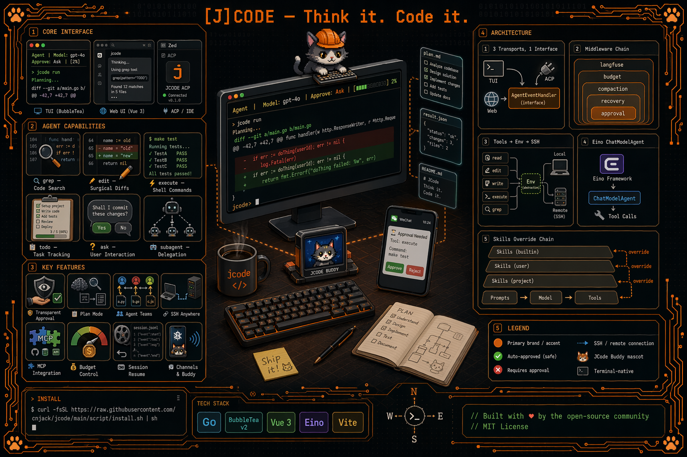
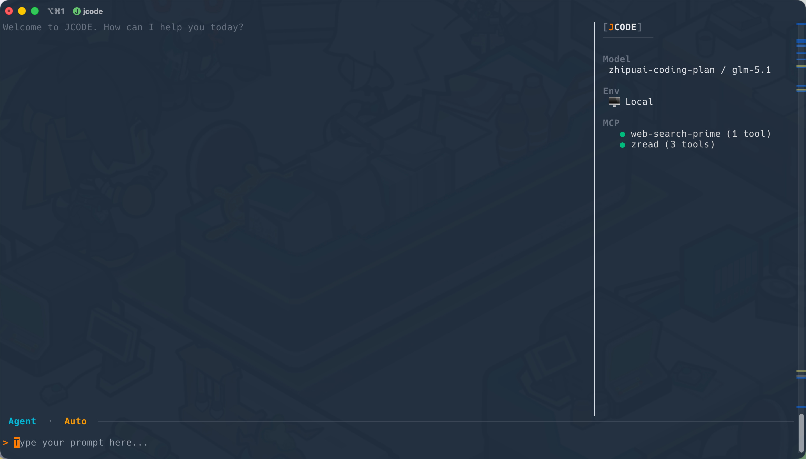
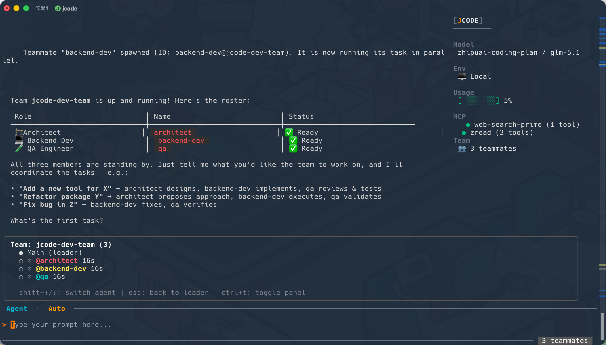
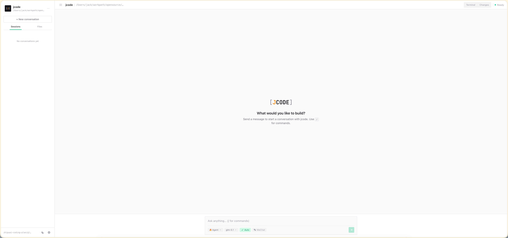

<div align="center">

<h1 align="center">
  <span style="font-family: 'JetBrains Mono', ui-monospace, SFMono-Regular, 'Roboto Mono', Menlo, Monaco, monospace; font-size: 32px; font-weight: 700;">
    [<span style="color: #FF8400;">J</span>CODE]
  </span>
</h1>

### **Think it. Code it.**
<p align="center">
  
</p>

**The AI coding agent that lives in your terminal.**

Describe tasks in plain language. [J]CODE reads your codebase, writes surgical edits,
runs commands, and shows every step — no black boxes.

Works locally and on remote servers over SSH. Supports any OpenAI-compatible model.

[📖 Documentation](https://cnjack.github.io/jcode) · [Install](#install) · [Features](#features) · [Configuration](#configuration) · [Changelog](#changelog)

</div>

---


<p align="center">
  
</p>

## Why jcode?

|                           |                                                                                |
| ------------------------- | ------------------------------------------------------------------------------ |
| **Transparent by design** | Every tool call is visible. Approve or reject edits before they happen.        |
| **Plan before you act**   | Plan Mode explores read-only and presents a structured plan for your review.   |
| **Parallel teams**        | Spawn multiple AI teammates that work simultaneously on different tasks.       |
| **SSH anywhere**          | All tools work seamlessly on remote machines — same experience, zero friction. |
| **Bring your own model**  | Any OpenAI-compatible API. Switch models mid-session with one keystroke.       |

## Install

### Quick Install (recommended)

```bash
curl -fsSL https://raw.githubusercontent.com/cnjack/jcode/main/script/install.sh | sh
```

### From Source

Requires **Go 1.22+** and **Node.js + pnpm**.

```bash
git clone https://github.com/cnjack/jcode.git
cd jcode
make install
```

### Update

```bash
jcode update
```

> **Windows users:** Windows locks the running `.exe` and prevents any file operation on it (including rename). `jcode update` will download the new version to `<current-path>.new` instead. Follow the printed instructions to exit jcode and manually replace the binary (e.g. `move /Y "jcode.exe.new" "jcode.exe"`).

First launch creates `~/.jcode/config.json` with a setup wizard. Run `jcode doctor` to verify model & MCP connectivity.

## Features

### Core Agent Loop

Describe a task in plain English. The agent reads your codebase, writes surgical edits, runs commands, and reports every step — no black boxes.

| Capability          | How it works                                                                                         |
| ------------------- | ---------------------------------------------------------------------------------------------------- |
| **File operations** | Read, edit (string-level diffs), and write files with inline before/after display                    |
| **Shell execution** | Run any command; output shown in a bordered box. Safe commands (`ls`, `git status`, …) auto-approved |
| **Regex search**    | `grep` tool with ripgrep fallback — search across entire codebases in seconds                        |
| **Todo tracking**   | Live `📋 Todo (2/5)` bar above the input area; agent updates progress automatically                  |
| **Ask user**        | Agent can prompt you with questions and choices mid-task when it needs clarification                 |

### 🤝 Agent Teams

Spawn multiple AI teammates that work **in parallel**, each with independent tools, conversation history, and environment. The lead agent coordinates; teammates idle until they receive an explicit message.

<p align="center">
  
</p>

### 🌐 SSH — work on any machine

Type `/ssh user@host` and every tool runs transparently on the remote host. No agents, no tunnels, no extra setup.

```
 You › /ssh deploy@10.0.1.5:/var/www/app

   ✓ SSH  Connected · linux/amd64

 You › why is nginx restarting?

   ⚙ Tool  execute  [deploy@10.0.1.5]  docker logs app-nginx-1 --tail 20

   ╭─────────────────────────────────────────────────────╮
   │  nginx: [emerg] bind() to 0.0.0.0:80 failed        │
   │  (98: Address already in use)                       │
   ╰─────────────────────────────────────────────────────╯

 ◆ Port 80 is already taken. Let me find what's holding it.
```

Save connections as named aliases and jump between hosts with `/ssh`:

```
  ┌─────── /ssh ────────────────────────────────────┐
  │  > 🔗 prod        deploy@10.0.1.5:/var/www/app  │
  │    🔗 staging      ci@10.0.1.8:/srv/staging      │
  │    ➕ Connect New SSH                             │
  └─────────────────────────────────────────────────┘
```

### 📋 Modes — Ask · Plan · Autopilot

Press **Shift+Tab** to cycle the session mode:

- **Ask** (default) — full tools, but you approve each non-trivial tool call.
- **Plan** — the agent explores your codebase **read-only** and presents a structured plan before touching any file. Review, approve or reject with feedback — then it executes step by step.
- **Autopilot** — full tools, every call auto-approved, end-to-end with no interruptions.

```
  Plan │ Model: openai / gpt-4o │ [██░░░░░░░░] 12%
```

### 🔌 MCP Integration

Connect any [MCP](https://modelcontextprotocol.io/)-compatible server — stdio, HTTP, or SSE — and its tools merge with the built-ins. Auto-reconnect with exponential backoff. Status shown live in the status bar.

```json
{
  "mcp_servers": {
    "github": { "type": "stdio", "command": "gh-mcp" },
    "db": { "type": "http", "url": "http://localhost:3001/mcp" }
  }
}
```

```
  Ask │ Model: openai / gpt-4o │ [████░░░░░░] 2% │ MCP: 2/5
```

### 💰 Token Usage & Budget Control

Real-time context window tracking with a **color-coded progress bar** in the status bar:

| Progress           | Color     | Meaning                                  |
| ------------------ | --------- | ---------------------------------------- |
| `[████░░░░░░] 45%` | 🟢 Green  | Comfortable — plenty of context left     |
| `[███████░░░] 78%` | 🟠 Orange | Approaching limit — consider compacting  |
| `[█████████░] 92%` | 🔴 Red    | Near limit — auto-compaction may trigger |

Set cost guardrails in `config.json`:

```json
{
  "budget": {
    "max_cost_per_session": 5.0,
    "warning_threshold": 0.8
  }
}
```

The agent receives in-context warnings when nearing limits and stops if the budget is exceeded. Model pricing is auto-fetched from [models.dev](https://models.dev).

### 🧠 Context Management

- **Auto-compaction** — when the context window fills up, older conversation is summarized while preserving the most recent messages
- **Manual compaction** — type `/compact` anytime to free up context
- **Smart prompt caching** — reduces redundant prompt computation across turns
- **AGENTS.md support** — global (`~/.jcode/AGENTS.md`), project-level, and local (`.local.md`, git-ignored) agent instructions with `@include` directives

### 🛠 Skills

Domain-specific skills loaded on demand. Built-in skills include **PR review** and **security review**. Add your own skill packs to `~/.jcode/skills/` or `<project>/.jcode/skills/`.

Skills register as slash commands — type `/review-pr` or `/security-review` to activate.

### ⚡ Subagents & Background Tasks

- **Subagents** — delegate subtasks to independent child agents (`explore`, `general`, or `coordinator` type) with up to 3 levels of nesting
- **Background commands** — long-running builds/tests run async; check with `/bg` or the `check_background` tool
- **Status tracking** — `Bg: 3 running` shown in status bar; task IDs for programmatic access

### 📼 Session Resume

Every conversation is recorded as JSONL. Resume any past session:

```
  ┌──────────────── Resume Session ─────────────────┐
  │  > 2026-03-12  gpt-4o      fix nginx crash       │
  │    2026-03-11  gpt-4o      refactor auth module  │
  │    2026-03-10  claude-3.5  add pagination logic  │
  └─────────────────────────────────────────────────┘
```

```bash
jcode sessions          # list sessions
jcode --resume <UUID>   # pick up where you left off
```

### 🌐 Web Interface

Start a browser-based UI with `jcode web`. Chat interface, file browser, built-in terminal, and full agent control — all accessible from `http://localhost:8080`.

<p align="center">
  
</p>

### 🧭 Context Awareness

At startup the agent automatically detects:

- Git branch, dirty status, last commit
- Project type (Go, Python, JS, Rust, Java, …)
- Directory structure
- SSH environment labels
- Available skills

No manual configuration needed — the agent adapts to your project.

## Keyboard Shortcuts

| Key           | Action                            |
| ------------- | --------------------------------- |
| **Enter**     | Submit prompt / select option     |
| **Ctrl+C**    | Press once to warn, twice to exit |
| **Shift+Tab** | Cycle mode (Ask → Plan → Autopilot) |
| **Ctrl+L**    | Model picker                      |
| **Ctrl+T**    | Toggle team panel                 |
| **Shift+↑/↓** | Switch between teammates          |
| **Esc**       | Return to leader view             |
| **/**         | Start slash command               |

## Slash Commands

| Command    | Action                       |
| ---------- | ---------------------------- |
| `/model`   | Switch model mid-session     |
| `/setting` | Open settings menu           |
| `/ssh`     | Connect to SSH host          |
| `/resume`  | Resume a previous session    |
| `/compact` | Compact conversation context |
| `/bg`      | Check background tasks       |
| `/<skill>` | Activate a loaded skill      |

## Configuration

Config lives at `~/.jcode/config.json`. Key sections:

| Section                 | What it controls                                  |
| ----------------------- | ------------------------------------------------- |
| `providers`             | API keys and base URLs for each model provider    |
| `model` / `small_model` | Active model and lightweight model for summaries  |
| `fallback_model`        | Fallback when primary model fails                 |
| `ssh_aliases`           | Named SSH connections                             |
| `mcp_servers`           | MCP server definitions (stdio / HTTP / SSE)       |
| `budget`                | Token and cost limits per session                 |
| `compaction`            | Auto-compaction threshold, recent message count   |
| `prompt`                | Memory size, cache, async env timeout             |
| `subagent`              | Parallel limit, nesting depth                     |
| `team`                  | Max teammates, mailbox poll interval              |
| `telemetry`             | Optional [Langfuse](https://langfuse.com) tracing |

```bash
jcode doctor    # verify model + MCP connectivity
jcode version   # show version, commit, build time
jcode update    # update to latest version
```

## Documentation

📖 Full documentation is available at [cnjack.github.io/jcode](https://cnjack.github.io/jcode)

## Changelog

See [CHANGELOG.md](./CHANGELOG.md) for release notes and version history.

## License

MIT
