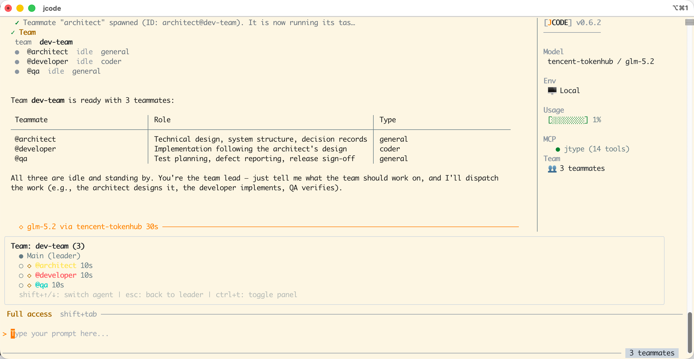
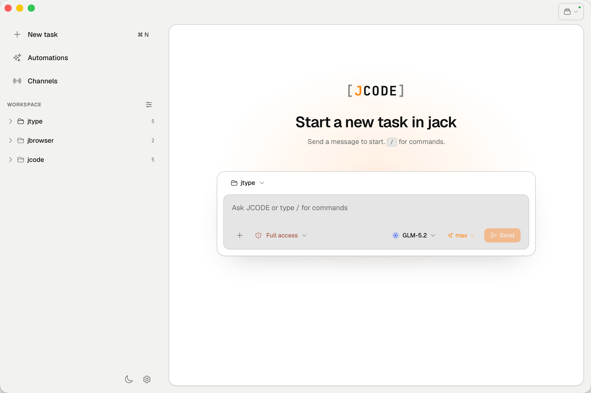

<div align="center">

<h1 align="center">
  <span style="font-family: 'JetBrains Mono', ui-monospace, SFMono-Regular, 'Roboto Mono', Menlo, Monaco, monospace; font-size: 32px; font-weight: 700;">
    [<span style="color: #FF8400;">J</span>CODE]
  </span>
</h1>

### **Think it. Code it.**

<p align="center">
  
</p>

**The AI coding agent that lives in your terminal — and now on your desktop.**

Describe a task in plain language. [J]CODE reads your codebase, writes surgical edits,
runs commands, and shows every step — no black boxes. Use it in your terminal, a
browser, or a native desktop app. Work locally or on a remote box over SSH or Docker.
Bring any OpenAI-compatible model.

<p align="center">
  <a href="https://github.com/cnjack/jcode/actions/workflows/ci.yml"></a>
  <a href="https://github.com/cnjack/jcode/tags"></a>
  <a href="go.mod"></a>
  <a href="LICENSE"></a>
  <a href="https://github.com/cnjack/jcode/stargazers"></a>
</p>

[📖 Documentation](https://www.j-code.net/docs) · [Install](#install) · [Features](#features) · [Interfaces](#interfaces) · [Configuration](#configuration) · [Changelog](#changelog)

</div>

---

<p align="center">
  
</p>

## Why jcode?

|                           |                                                                              |
| ------------------------- | ---------------------------------------------------------------------------- |
| **Transparent by design** | Every tool call is visible. Approve or reject edits before they happen.      |
| **Plan before you act**   | Plan Mode explores read-only and presents a structured plan for your review. |
| **Parallel teams**        | Spawn multiple AI teammates that work simultaneously on different tasks.     |
| **Runs anywhere**         | Terminal, browser, or native desktop app — one engine, same experience.      |
| **Local or remote**       | Every tool works identically over SSH or inside a Docker container.          |
| **Bring your own model**  | Any OpenAI-compatible API. Switch models mid-session with one keystroke.     |

## Install

### Quick install (recommended)

```bash
curl -fsSL https://raw.githubusercontent.com/cnjack/jcode/main/script/install.sh | sh
```

### From source

Requires **Go 1.22+** and **Node.js + pnpm**.

```bash
git clone https://github.com/cnjack/jcode.git
cd jcode
make install
```

First launch creates `~/.jcode/config.json` with a setup wizard. Run `jcode doctor`
to verify model & MCP connectivity. For a full walkthrough see the
[Get Started guide](https://www.j-code.net/docs/get-started).

### First commands

```bash
jcode                                  # start an interactive session
jcode -p "fix the failing test in ./auth"   # one-shot, non-interactive
jcode --resume <UUID>                  # pick up a previous session
jcode web                              # browser UI at http://localhost:8080
```

### Update

```bash
jcode update
```

> **Windows users:** Windows locks the running `.exe` and blocks any file operation on it (including rename). `jcode update` downloads the new version to `<current-path>.new` instead — follow the printed instructions to exit jcode and swap the binary (e.g. `move /Y "jcode.exe.new" "jcode.exe"`).

## Features

### Core agent loop

Describe a task in plain English. The agent reads your codebase, writes surgical edits, runs commands, and reports every step.

| Capability          | How it works                                                                                          |
| ------------------- | ----------------------------------------------------------------------------------------------------- |
| **File operations** | Read, edit (string-level diffs), and write files with inline before/after display                    |
| **Shell execution** | Run any command; output shown in a bordered box. Safe commands (`ls`, `git status`, …) auto-approved  |
| **Regex search**    | `grep` tool with ripgrep fallback — search across entire codebases in seconds                         |
| **Todo tracking**   | Live `📋 Todo (2/5)` bar above the input; the agent updates progress automatically                    |
| **Ask user**        | The agent can stop and ask you a question with choices mid-task when it needs clarification            |

### 📋 Modes — Ask for approval · Plan · Full access

Press **Shift+Tab** to cycle the session mode:

- **Ask for approval** (default) — full tools, but you approve each non-trivial tool call.
- **Plan** — the agent explores your codebase **read-only** and presents a structured plan before touching any file. Approve or reject with feedback — then it executes step by step.
- **Full access** — full tools, every call auto-approved, end-to-end with no interruptions.

```
  Plan │ Model: openai / gpt-4o │ [██░░░░░░░░] 12%
```

### 🤝 Agent teams

Spawn multiple AI teammates that work **in parallel**, each with independent tools, conversation history, and environment. The lead agent coordinates; teammates idle until they receive an explicit message.

<p align="center">
  
</p>

### 🎯 Session goals

Set a persistent objective and let the agent keep working toward it across turns — it auto-continues until the goal verifiably completes, marks itself blocked, or hits a safety cap. A 🎯 indicator shows an active goal.

```
 You › /goal ship the new /export endpoint with tests and docs

   🎯 Goal set · the agent will keep going until it's done

 You › /goal status      # check progress
 You › /goal clear       # drop the goal
```

### 🎨 Themes

Seven built-in color themes, defined once and rendered identically in the terminal **and** the web UI. Type `/theme` in the TUI for a live-preview picker (arrow keys repaint the whole UI, Enter persists); the web Appearance tab adds a System (follow-OS) option.

- **Dark:** jcode Dark (default), Midnight, Dracula, Nord
- **Light:** jcode Light, GitHub Light, Solarized Light

### 🌐 SSH & Docker — work on any machine

Type `/ssh user@host` and every tool runs transparently on the remote host. No agents, no tunnels, no extra setup.

```
 You › /ssh deploy@10.0.1.5:/var/www/app

   ✓ SSH  Connected · linux/amd64

 You › why is nginx restarting?

   ⚙ Tool  execute  [deploy@10.0.1.5]  docker logs app-nginx-1 --tail 20

   ╭─────────────────────────────────────────────────────╮
   │  nginx: [emerg] bind() to 0.0.0.0:80 failed         │
   │  (98: Address already in use)                        │
   ╰─────────────────────────────────────────────────────╯

 ◆ Port 80 is already taken. Let me find what's holding it.
```

Save connections as named aliases and jump between hosts with `/ssh`:

```
  ┌─────── /ssh ────────────────────────────────────┐
  │  > 🔗 prod        deploy@10.0.1.5:/var/www/app   │
  │    🔗 staging      ci@10.0.1.8:/srv/staging       │
  │    ➕ Connect New SSH                              │
  └──────────────────────────────────────────────────┘
```

In the web UI you can also bind a task to a **Docker container** — every file and command runs inside it via `docker exec`, and the embedded terminal opens a real TTY in the container. Saved Docker aliases live in `docker_aliases`.

### 🌍 Browser use

The agent can see and operate a real browser: open pages, read them as uid-tagged
text snapshots, click, type, scroll, and manage tabs — with risky actions gated by
per-site approvals. Two backends, same tools: a **managed** Chrome jcode launches
itself (isolated profile — great for verifying `localhost` after frontend changes),
or **your** Chrome via the jcode Browser Bridge extension (your logins, your tabs).
Toggle with `/browser` in the TUI or Settings → Browser on the web. See the
[Browser Use guide](https://www.j-code.net/docs/overview/browser-use).

> The extension currently installs via `chrome://extensions` → Developer mode →
> **Load unpacked** (from the repo's `extension/` folder) — the Chrome Web Store
> listing is in review.

### ⏱ Automations

Schedule agent tasks to run on a **cron schedule** or fire them **manually** from the web UI. Each run is a normal jcode session, just tagged and tracked — so you get the full transcript, tool calls, and approvals for every run.

### 🔌 MCP integration

Connect any [MCP](https://modelcontextprotocol.io/)-compatible server — stdio, HTTP, or SSE — and its tools merge with the built-ins. OAuth-protected servers are supported (built-in login flow). Auto-reconnect with exponential backoff; status shown live in the status bar.

```json
{
  "mcp_servers": {
    "github": { "type": "stdio", "command": "gh-mcp" },
    "db": { "type": "http", "url": "http://localhost:3001/mcp" }
  }
}
```

```
  Ask for approval │ Model: openai / gpt-4o │ [████░░░░░░] 2% │ MCP: 2/5
```

### 🛠 Skills

Domain-specific skills loaded on demand and exposed as slash commands. Built-in skills include **PR review** (`/review-pr`), **security review** (`/security-review`), **PR comments** (`/pr-comments`), and **submit PR** (`/submit-pr`). Drop your own skill packs in `~/.jcode/skills/` or `<project>/.jcode/skills/` and they register automatically.

### 💰 Token usage & budget control

Real-time context window tracking with a **color-coded progress bar** in the status bar:

| Progress           | Color     | Meaning                                  |
| ------------------ | --------- | ---------------------------------------- |
| `[████░░░░░░] 45%` | 🟢 Green  | Comfortable — plenty of context left     |
| `[███████░░░] 78%` | 🟠 Orange | Approaching limit — consider compacting  |
| `[█████████░] 92%` | 🔴 Red    | Near limit — auto-compaction may trigger |

Set cost guardrails in `config.json`:

```json
{
  "budget": {
    "max_cost_per_session": 5.0,
    "warning_threshold": 0.8
  }
}
```

The agent receives in-context warnings near limits and stops if the budget is exceeded. Model pricing is auto-fetched from [models.dev](https://models.dev).

### 🧠 Context management

- **Auto-compaction** — when the context window fills up, older conversation is summarized while preserving the most recent messages
- **Manual compaction** — type `/compact` anytime to free up context
- **1M-context support** — per-model context windows resolve from config → registry → fallback, so large-window models aren't capped at 200K
- **Smart prompt caching** — reduces redundant prompt computation across turns
- **AGENTS.md support** — global (`~/.jcode/AGENTS.md`), project-level, and local (`.local.md`, git-ignored) instructions with `@include` directives

### ⚡ Subagents & background tasks

- **Subagents** — delegate subtasks to independent child agents (`explore`, `general`, or `coordinator` type) with up to 3 levels of nesting
- **Background commands** — long-running builds/tests run async; check with `/bg` or the `check_background` tool
- **Status tracking** — `Bg: 3 running` shown in the status bar; task IDs for programmatic access

### 📼 Session resume

Every conversation is recorded as JSONL. Resume any past session:

```
  ┌──────────────── Resume Session ─────────────────┐
  │  > 2026-03-12  gpt-4o      fix nginx crash       │
  │    2026-03-11  gpt-4o      refactor auth module  │
  │    2026-03-10  o4-mini     add pagination logic  │
  └──────────────────────────────────────────────────┘
```

```bash
jcode sessions          # list sessions
jcode --resume <UUID>   # pick up where you left off
```

### 🧭 Context awareness

At startup the agent automatically detects your Git branch, dirty status and last commit, the project type (Go, Python, JS, Rust, Java, …), the directory structure, the SSH/Docker environment, and available skills — no manual configuration needed.

## Interfaces

Same engine, four front ends — pick whatever fits the moment.

### Terminal (default)

The full TUI: `jcode`. Everything above lives here.

### 🌐 Web

Start a browser-based UI with `jcode web`. Chat, file browser, built-in terminal, and full agent control at `http://localhost:8080`. Light and dark themes; remote-connect wizard for SSH and Docker.

<p align="center">
  
</p>

### 🖥 Desktop

A native desktop app (built with [Tauri](https://tauri.app)) wraps the **same** web UI in a real OS window with native integration: OS notifications, a menu-bar tray, close-to-tray, single-instance focus, window-state memory, a global show/hide shortcut, and a native folder picker. The Go backend runs as an embedded sidecar — no separate server to start.

<p align="center">
  
</p>

```bash
make desktop-dev     # run the app in development (rebuilds the sidecar first)
make desktop-build   # build a distributable bundle (.app/.dmg/.msi)
```

> Building the desktop app additionally needs the [Rust toolchain](https://rustup.rs) (and, on Linux, the [Tauri system dependencies](https://v2.tauri.app/start/prerequisites/)).

See the [Desktop App guide](https://www.j-code.net/docs/desktop) for the architecture and security model.

### Editor (ACP)

jcode also speaks the Agent Client Protocol (ACP), so it runs inside ACP-compatible editors like [Zed](https://zed.dev) via `jcode acp`.

## Reference

### CLI commands

```bash
jcode                # interactive session (root command)
jcode -p "<prompt>"  # one-shot, non-interactive
jcode --resume <ID>  # resume a session by UUID
jcode web            # browser UI
jcode acp            # run as an ACP agent for editors
jcode mcp            # manage MCP servers
jcode automation     # manage automations
jcode sessions       # list saved sessions
jcode doctor         # verify model + MCP connectivity
jcode version        # version, commit, build time
jcode update         # update to the latest release
```

### Slash commands

| Command           | Action                                                  |
| ----------------- | ------------------------------------------------------- |
| `/model`          | Switch model mid-session                                |
| `/setting`        | Open the settings menu                                  |
| `/theme`          | Open the theme picker (live preview)                    |
| `/goal`           | Set, check (`status`), or `clear` the session goal      |
| `/ssh`            | Connect to an SSH host                                  |
| `/browser`        | Browser-use status / `on` / `off`                       |
| `/mcp`            | Manage MCP server connections                           |
| `/resume`         | Resume a previous session                               |
| `/compact`        | Compact the conversation context                        |
| `/bg`             | Check background tasks                                  |
| `/channel`        | Manage messaging channel connections                    |
| `/help`           | Show keyboard shortcuts and command help                |
| `/<skill>`        | Run a loaded skill (e.g. `/review-pr`, `/security-review`) |

<details>
<summary><b>Keyboard shortcuts</b></summary>

| Key            | Action                                              |
| -------------- | --------------------------------------------------- |
| **Enter**      | Submit prompt / select option                       |
| **Shift+Enter**| Insert a newline                                    |
| **Ctrl+C**     | Press once to warn, twice to exit                   |
| **Shift+Tab**  | Cycle mode (Ask for approval → Plan → Full access)  |
| **Ctrl+L**     | Model picker                                        |
| **Ctrl+T**     | Toggle the team panel                               |
| **Shift+↑ / ↓**| Switch between teammates                            |
| **Esc**        | Dismiss command suggestions / return to leader view |
| **Ctrl+E**     | Expand / collapse subagent output                   |
| **Ctrl+Y**     | Copy the last assistant message                     |
| **Ctrl+↑ / ↓** | Scroll the sidebar todo list                        |
| **/**          | Start a slash command                               |
| **? / F1**     | Open the keyboard-shortcuts help                    |

</details>

## Configuration

Config lives at `~/.jcode/config.json`. Key sections:

| Section                       | What it controls                                                          |
| ----------------------------- | ------------------------------------------------------------------------- |
| `providers`                   | API keys, base URLs, headers, and custom models per provider              |
| `model` / `small_model`       | Active model and the lightweight model used for summaries/compaction      |
| `fallback_model`              | Model to fall back to when the primary fails                              |
| `default_mode`                | Startup session mode: `approval` (default), `plan`, or `full_access`      |
| `theme`                       | Built-in color theme name; empty auto-selects from the terminal background |
| `context_limits`              | Per-model context-window overrides (tokens)                               |
| `default_context_limit`       | Fallback context window for unknown models (default `200000`)             |
| `max_iterations`              | Maximum agent-loop iterations per turn                                    |
| `ssh_aliases`                 | Named SSH connections                                                     |
| `docker_aliases`              | Named Docker container workspaces                                         |
| `mcp_servers`                 | MCP server definitions (stdio / HTTP / SSE, headers, OAuth)               |
| `browser`                     | Browser use: backend, approvals, site permissions, dev mode               |
| `budget`                      | Token and cost limits per session                                         |
| `compaction`                  | Auto-compaction threshold and recent-message count                        |
| `prompt`                      | Memory size, prompt cache, async env timeout                              |
| `subagent`                    | Parallel limit and nesting depth                                          |
| `team`                        | Max teammates and mailbox poll interval                                   |
| `channel`                     | External messaging channel settings                                       |
| `disabled_providers` / `disabled_skills` | Providers / skills to exclude                                  |
| `telemetry`                   | Optional [Langfuse](https://langfuse.com) tracing                         |

```bash
jcode doctor    # verify model + MCP connectivity
jcode version   # show version, commit, build time
jcode update    # update to latest version
```

## Documentation

📖 Full documentation is available at [www.j-code.net/docs](https://www.j-code.net/docs).

## Changelog

See [CHANGELOG.md](./CHANGELOG.md) for release notes and version history.

## License

MIT
