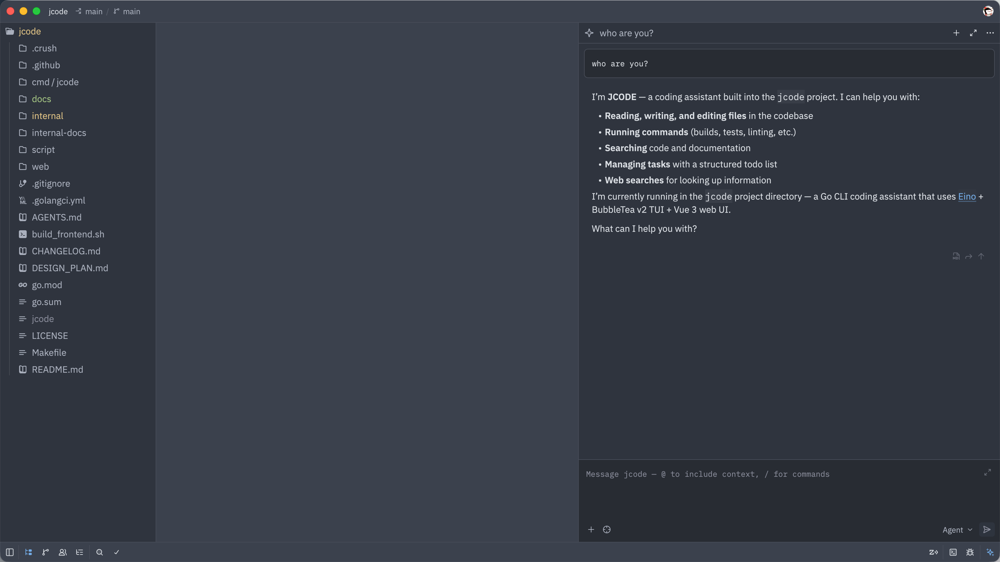

# IDE Integration (ACP)

jcode supports integration with IDEs through the [Agent Client Protocol (ACP)](https://agentclientprotocol.com/), allowing you to use the AI coding agent directly within your editor.

## What Is ACP?

The Agent Client Protocol is a standard for connecting AI coding agents to editors and IDEs. When you run `jcode acp`, it starts a headless JSON-RPC server on stdio — no TUI, just protocol-level communication designed for programmatic integration.

## Prerequisites

Make sure jcode is installed and in your PATH:

```bash
which jcode
```

If not in PATH, use the full path in the IDE configuration below.

## Zed

[Zed](https://zed.dev/) has native ACP support.



Add the following to Zed's settings file (`~/.config/zed/settings.json`):

```json
{
  "agent_servers": {
    "jcode": {
      "type": "custom",
      "command": "jcode",
      "args": ["acp"],
      "env": {}
    }
  }
}
```

| Field | Description |
|---|---|
| `type` | Fixed value `"custom"` |
| `command` | Path to jcode binary. Use full path if not in PATH |
| `args` | `["acp"]` to start in ACP mode |
| `env` | Environment variables (usually empty) |

After saving, you can create jcode sessions in Zed's **Agent panel**.

## JetBrains IDEs

JetBrains IDEs (IntelliJ IDEA, GoLand, PyCharm, WebStorm, etc.) support ACP through the AI Chat plugin.

{: .note }
If you don't have a JetBrains AI subscription, enable `llm.enable.mock.response` in the Registry to access the AI Chat feature. Press **Shift** twice and search for "Registry" to open it.

In the AI Chat panel menu, click **"Configure ACP agents"** and add:

```json
{
  "agent_servers": {
    "jcode": {
      "command": "/usr/local/bin/jcode",
      "args": ["acp"],
      "env": {}
    }
  }
}
```

{: .important }
`command` must be the **full path** to the jcode binary. Run `which jcode` in your terminal to find it.

After saving, select **jcode** in the AI Chat Agent selector.

## VS Code / Cursor

VS Code and Cursor can integrate with jcode as an ACP agent. Add to your `settings.json`:

```json
{
  "chat.agent.configs": [
    {
      "name": "jcode",
      "command": "jcode",
      "args": ["acp"]
    }
  ]
}
```

Or use the **Command Palette** → "Chat: Add Agent" to configure.

## How It Works

When you start an ACP session through your IDE:

1. The IDE launches `jcode acp` as a subprocess
2. Communication happens over **stdin/stdout** using JSON-RPC
3. jcode provides all its built-in tools (file read/write, search, execute, etc.)
4. Tool calls and approvals are handled through the IDE's agent UI
5. All MCP servers configured in `~/.jcode/config.json` are available

The agent uses the same model configuration, skills, and tools as the terminal TUI — just with a different interface.

## Troubleshooting

| Problem | Solution |
|---|---|
| Agent not appearing | Verify `jcode acp` works from your terminal |
| Command not found | Use full path: `which jcode` to find it |
| Model errors | Run `jcode doctor` to verify API connectivity |
| No tools available | Check `~/.jcode/config.json` for valid provider config |
