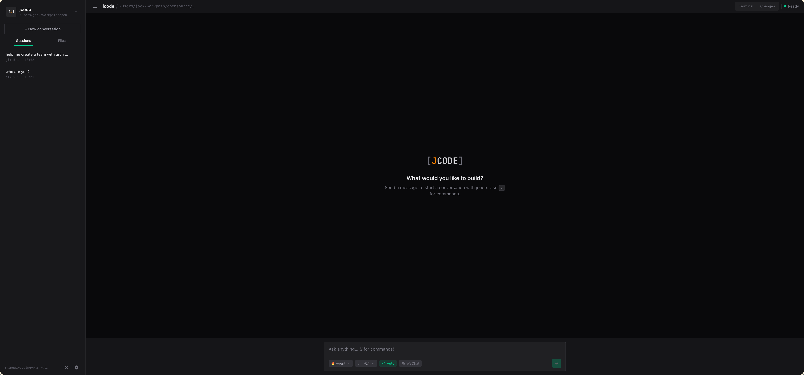

# Web Interface

jcode includes a browser-based interface for users who prefer a visual UI over the terminal. The web UI provides chat, file browsing, terminal access, and full agent control.

> Prefer a native window with OS notifications and a menu-bar tray? The same UI ships as a [Desktop App](desktop).


## Starting the Web Server

```bash
jcode web
```

Options:

| Flag | Default | Description |
|---|---|---|
| `--port` | 8080 | HTTP server port |
| `--host` | 127.0.0.1 | Server host/interface |

Then open `http://localhost:8080` in your browser.

{: .note }
By default, the server binds to `127.0.0.1` (localhost only). Use `--host 0.0.0.0` to allow access from other machines.

## Features

### Chat Interface

Send messages to the agent and see streaming responses. Tool calls and results are displayed inline, just like in the TUI.

### File Browser

Browse your project directory and view file contents directly in the browser.

### Built-in Terminal

Open a full PTY terminal in the browser. Run any command as if you were in a local terminal.

### Session Management

List, view, and switch between sessions. Start a new session or resume a previous one.

### Model & Settings

Switch models, change the session mode (Ask / Plan / Autopilot), and manage configuration — all from the web interface.

### Theme / Dark Mode

Toggle between **Light**, **Dark**, and **System** themes from the settings dialog. The theme preference is persisted in `localStorage` and applied instantly across all components. When set to **System**, the UI follows your OS appearance preference automatically.



### Project Switching

Switch between different project directories without restarting the server.

## API Endpoints

The web server exposes an HTTP API and a WebSocket stream for programmatic access:

| Endpoint | Description |
|---|---|
| `POST /api/chat` | Send a message to the agent |
| `POST /api/stop` | Cancel current execution |
| `GET /api/ws` | WebSocket stream of agent events |
| `GET /api/sessions` | List sessions |
| `POST /api/sessions` | Create new session |
| `GET /api/models` | List available models |
| `POST /api/model` | Switch active model |
| `POST /api/mode` | Switch session mode (`ask`, `plan`, or `autopilot`) |
| `GET /api/todos` | Get current todo items |
| `GET /api/files` | Browse directory |
| `POST /api/exec` | Execute a shell command |
| `POST /api/approval` | Approve/reject a tool call |
| `GET /api/mcp` | List MCP servers and status |
| `GET /api/skills` | List available skills |
| `POST /api/pty` | Create a terminal session |
| `GET /api/channel` | Get channel connection status |
| `POST /api/channel/login` | Start channel login (returns QR code) |
| `POST /api/channel/logout` | Disconnect channel |
| `POST /api/channel/enable` | Enable notifications |
| `POST /api/channel/disable` | Disable notifications |

{: .tip }
The REST API makes it easy to integrate jcode into your own tools and workflows.
