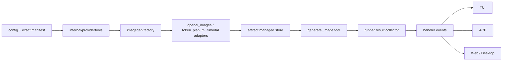

# 图片生成与 Provider Tools 技术架构

> 日期：2026-08-08
> 状态：Approved for implementation（Revision 2 双红队复审 GO；Revision 6 正式动效合同）
> Revision：6（Image Model 自动注册；Full access 预授权 billable intent；扫描织网生成态）
> 上游：`provider-tools-image-generation-prd.md`、`image-generation-poc-report.md`

## 1. 设计结论

首个实现单元由四条不可拆的链路组成：

1. `CapabilityResolver` 精确判定 provider/profile/endpoint/model/protocol；
2. `billable_external` 始终构造并校验不可变 intent；Ask for approval / Auto 逐次授权，Full access 不弹审批；
3. `generate_image` 只把验证后的 bytes 提交给 managed Artifact；
4. `queued → generating → saving → terminal` 是按 ToolCallID 归并的内部 lifecycle；TUI/ACP 可文本降级，Web/Desktop 另按 renderer visibility 决定是否显示媒体卡。

任意一条缺失时，功能保持不可配置/不可注册。没有“工具存在但点了才报没配”的降级。

首轮安全与前端红队给出 NO-GO。Revision 2 新增五个发布不变量：provider POST 禁止重定向；费用审批基于不可变 typed intent；dispatch 前必须落 durable operation journal；provider MCP credential 只能来自内置可信 preset；所有额度/次数在 session ledger 内原子 reserve/consume。

## 2. 发布范围

### 2.1 本次实现

- 自定义 OpenAI-like Images endpoint；
- BigModel `cogview-3-flash` 精确 capability rule；
- Alibaba Token Plan `wan2.7-image` / `wan2.7-image-pro` 精确 rule 与专属同步 `token_plan_multimodal` adapter；
- 全局 Image Model；
- 条件注册的 `generate_image(prompt, size?)`，P0 严格单图且请求 schema 不暴露 `count`；
- provider URL/base64 同步结果；
- managed Artifact v2、本地回放、Web/Desktop 图片卡、TUI 路径、ACP 文本/resource-link 降级；
- BigModel Search MCP preset，先完成 MCP secret mask/merge；
- Settings 的 Image Model / capability 状态；选择有效 Image Model 后自动注册图片工具；Provider Web Search 由当前 Chat Model exact provider 的 policy 自动注入；
- Ask for approval / Auto 的费用批准只显示“仅本次/拒绝”；Full access 作为统一会话模式预授权，不设计独立图片 session grant。

### 2.2 后续 adapter gate

- Kimi Search 按官方 Formula/`$web_search` 独立实现；Kimi 当前无 image generation；
- image edit、reference images、async generation、自动 GC、ACP inline pixels 为后续 gate。

## 3. 包与依赖方向



依赖约束：

- `config` 不 import `providertools`/`imagegen`；只定义 JSON structs；
- `providertools` 读取 config snapshot 并解析精确 manifest；Settings 不发图片 probe，只有用户批准的真实工具调用会访问图片供应商；
- `imagegen` 不依赖 command/handler/Web；
- `artifact` 不依赖 transport；
- `tools` 只接收已解析 adapter、ArtifactSink 与 run-scoped event sink；
- `runner` 拥有 ToolCallID 与 result collector；工具不 import `agent`，避免环依赖。

## 4. 配置合同

新增字段均 optional，旧 config round-trip 语义不变。

```go
type ProviderToolPolicy struct {
    Enabled            bool `json:"enabled,omitempty"`
    MaxCallsPerTurn    int  `json:"max_calls_per_turn,omitempty"`
    MaxCallsPerSession int  `json:"max_calls_per_session,omitempty"`
}

type ImageEndpointConfig struct {
    Protocol string             `json:"protocol,omitempty"` // openai_images
    BaseURL  string             `json:"base_url,omitempty"`
    Models   []ImageModelConfig `json:"models,omitempty"`
    AssetHosts []string         `json:"asset_hosts,omitempty"`
}

type ImageModelConfig struct {
    ID    string   `json:"id"`
    Name  string   `json:"name,omitempty"`
    Sizes []string `json:"sizes,omitempty"`
}

type ProviderConfig struct {
    // existing fields...
    Protocol      string                        `json:"protocol,omitempty"`
    ProviderTools map[string]ProviderToolPolicy `json:"provider_tools,omitempty"`
    ImageEndpoint *ImageEndpointConfig          `json:"image_endpoint,omitempty"`
}

type MediaConfig struct {
    RetentionDays int   `json:"retention_days,omitempty"`
    MaxTotalBytes int64 `json:"max_total_bytes,omitempty"`
}

type Config struct {
    // existing fields...
    ImageModel string       `json:"image_model,omitempty"` // provider/model
    Media      *MediaConfig `json:"media,omitempty"`
}
```

`ProviderToolPolicy` 不包含 `image_generation`。它只管理必须绑定当前 Agent/Chat Model provider exact adapter 的 Web Search 等 provider-bound tools；图片生成由独立 `ImageModel` 角色解析。

关键语义：

- Provider profile 是凭据边界。若图片 API 使用另一把 key，用户创建另一 provider profile；系统不在两个 profile 间猜测/复制 key。
- 自定义 provider 必须显式设置 `image_endpoint.protocol=openai_images`、能力专属 BaseURL 和 image model。Chat `/models` 结果不会自动变成生图模型。
- image endpoint 本身可以构成 image-only provider；它不要求伪造 chat BaseURL/model。Settings 对 `base_url:null` 采用显式清除语义，不能把注册表默认 chat URL 悄悄写回。
- 显式 custom image endpoint 不是永远的 `unknown`：当 protocol 属于 JCode 已实现 allowlist、BaseURL 通过安全校验且 model 明确列在 `image_endpoint.models` 时，resolver 形成 custom rule，availability=`supported`。未知 protocol 仍为 `unknown`。
- Custom endpoint 未配置 `asset_hosts` 时只接受 base64 或与 endpoint 同 origin 的 URL。`asset_hosts` 只接受 exact hostname 或 `*.example.com` 形式的单标签受限 wildcard；canonicalize IDNA/小写/尾点/端口后匹配，禁止 IP wildcard。系统不会通过运行时结果静默学习或写入新 host。
- 内置 profile 的人工 manifest 可以提供 image endpoint/model；用户显式 `image_endpoint` 覆盖后形成 custom endpoint profile，必须重新匹配，不继承品牌能力。
- `ImageModel` 是图片生成的完整角色选择。选择项能精确解析到受支持 adapter/runtime 且凭据存在时，normal-mode catalog 直接构造 `generate_image`；不存在 provider image enable 或 session image override。
- Web Search 等可能计费的 provider-bound policy 默认 false，并且只能绑定当前 Agent/Chat Model 的 provider exact adapter；配置中存在另一家 provider 不能触发跨 provider 注入。
- 图片生成的费用授权不借用配置开关。Ask for approval / Auto 每次调用走 `billable_external` 一次性审批；Full access 直接预授权通过校验的 billable intent。
- 项目 overlay 不得覆盖 global ImageModel、Media 或 provider credentials。

## 5. Capability resolver

```go
type CapabilityKey struct {
    ProviderProfileID string
    CredentialKind    string
    EndpointProfile   string
    ModelID           string
}

type Rule struct {
    CapabilityID string
    Key          CapabilityKey
    Runtime      string
    AdapterID    string
    EndpointURL  string
    AssetHosts   []HostRule
    Billable     bool
}
```

算法：

1. 解析 `provider/model`；不存在 provider、model 或凭据则 unavailable。
2. 对 BaseURL canonicalize：只允许 HTTPS，移除 query/fragment/userinfo，规范 host/port/path/trailing slash。
3. 内置 endpoint 与人工 rule 精确匹配；用户覆盖形成 `custom:<sha256(canonical-url)>`。
4. registry 的 `output:image` 只做 catalog 候选；协议/runtime/endpoint 只能来自唯一 rule 或显式 custom `image_endpoint`。
5. 0 条 rule 返回 `unknown`，1 条返回 resolved capability，多条返回 `ambiguous_capability` 并 fail closed。
6. `image_model` 的精确 adapter route 可解析且凭据存在时，在 normal mode 构造工具；不读取 provider/session 图片开关。dispatch 前再次核对 config epoch 与 credential fingerprint。

Provider-bound capability 使用另一条 resolver：先锁定当前 Agent/Chat Model 的 provider/profile/model，再在该 exact adapter 内应用 provider policy。它不得扫描其他已配置 provider，也不读取 task/session override；`image_generation` 是唯一由独立模型角色跨 chat provider 路由的能力。

BigModel rule 必须保存完整 Images endpoint，不能把 Chat BaseURL 当字符串前缀。当前 live POC 证明本机 Coding profile 的 `/api/coding/paas/v4/images/generations` 可用；官方 general endpoint 是另一 profile。两者分别建 rule/验证，不互相 fallback。

模型 API 增加 `input_modalities`、`output_modalities`、`capability_availability`；Chat picker 只取 `output:text && tool_call`，Image picker 只取 resolved image capability。

## 6. Image generation service

### 6.1 接口

```go
type Generator interface {
    Generate(context.Context, Request) (Generation, error)
}

type Generation struct {
    Items []ImageSource
}

type ImageSource interface {
    Open(context.Context) (io.ReadCloser, error)
}
```

`Generate` 只提交一次 provider POST；`ImageSource.Open` 负责读取 URL/base64。两步分离允许在 provider 返回后准确发 `saving`。

### 6.2 `openai_images`

- POST `{image endpoint}/images/generations`；
- P0 `n=1`，不自动 fallback、不自动重试 POST；
- 同时有 `b64_json`/`url` 时优先 base64；
- 不强制 `response_format`；
- 结构化 401/403/429/5xx 映射到统一错误码；不保存任意 response body；
- 生成请求只携带 provider credentials；外部 asset URL 下载不转发 Authorization/custom headers。
- Provider POST 使用独立 client，`CheckRedirect` 一律返回错误；任何 3xx 都映射为 `provider_redirect_rejected`，不能把 Bearer 或自定义 header 带到第二个 origin。
- 自定义 headers 只能追加普通 provider header；拒绝用户覆盖 `Authorization`、`Proxy-Authorization`、`Host`、`Content-Length`、`Content-Type` 和 hop-by-hop headers。

### 6.3 `token_plan_multimodal`

- 只对 Alibaba Token Plan exact profile 使用专属同步 endpoint：`POST https://token-plan.cn-beijing.maas.aliyuncs.com/api/v1/services/aigc/multimodal-generation/generation`；不能改走通用 DashScope async task 或 OpenAI Images；
- 请求使用 Token Plan Bearer credential、`input.messages[].content[].text` 和 `parameters{size,n:1}`，禁止 `X-DashScope-Async`；
- 同步解析 `output.choices[].message.content[].image`；`content.type` 为空或 `image` 均接受，其他非空值 fail closed；
- 生成 POST 恰好一次且零自动重试；返回图片 URL 立即交给同一安全 downloader，asset 请求不继承 provider credential/header。

### 6.4 安全 downloader

- HTTPS only，asset redirect 最多 3 次；每跳重新校验 scheme、host 与 DNS 解析；
- provider POST 与 asset GET 都使用受控 `DialContext` 校验实际连接 IP；校验覆盖 IPv4/IPv6、IDNA、尾点、显式端口与 DNS rebinding，不能只做调用前 `LookupIP`；
- 安全 transport 默认 `Proxy=nil`、`CookieJar=nil`，忽略 `HTTP_PROXY/HTTPS_PROXY/NO_PROXY`，也不接受外部自定义 RoundTripper。未来可信代理模式必须单独建 profile 并证明目标域名/IP 校验发生在代理侧；P0 不支持。
- 拒绝 loopback、private、link-local、multicast、unspecified、metadata IP 和 DNS rebinding；
- 内置 adapter asset host 必须匹配 manifest allowlist；custom endpoint 需要显式 allowlist；
- JSON 2 MiB、单图 20 MiB、单请求 64 MiB、最长边 8192、总像素 40 MP；
- sniff/decode 后只接受 JPEG/PNG/WebP；拒绝 SVG/HTML/GIF 动图；
- 扩展名只由真实 MIME 决定；
- provider POST 不重试；幂等 asset GET 最多安全重试 2 次；
- cancellation/validation/persist failure 清理 temp；日志不含 prompt、signed URL、base64、Authorization、body。

## 7. Managed Artifact v2

### 7.1 Record

```go
type StorageKind string

const (
    StorageWorkspace StorageKind = "workspace"
    StorageManaged   StorageKind = "managed"
)

type Record struct {
    ID               string
    SessionID        string
    StorageKind      StorageKind
    RelativePath     string // legacy workspace field
    RelativeKey      string // managed: images/<uuid>.<ext>
    Title            string
    Kind             Kind
    MediaType        string
    Size             int64
    Width            int
    Height           int
    SHA256           string
    ProviderID       string
    ModelID          string
    ParentArtifactID string
    OperationID      string
    ToolCallID       string
    Revision         int
    UpdatedAt        time.Time
    Status           Status
    Focus            bool
    Shareable        bool
}
```

旧记录缺 `storage_kind` 时解释为 workspace，ID 与 `show_artifact` 行为不变。

### 7.2 Storage

```text
~/.jcode/artifacts/<sha256(session-id)>/images/<generation-id>.<sniffed-ext>
```

落盘顺序：

1. Session ID 沿用现有兼容格式，但目录只使用其 SHA-256；generation ID 由系统生成 UUID；
2. 在目标目录创建 0600 temp（目录 0700）；
3. 限流复制并同时计算 SHA-256；
4. sniff/decode/像素校验；
5. `Sync` 后 atomic rename；
6. `RecordArtifact` 追加 session JSONL；
7. 发布 `artifact_upserted`；
8. 返回 ArtifactRef。

JSONL 是 metadata 的单一事实来源；可选 storage journal 仅用于 GC，不参与 UI replay。provider 成功但 metadata append 失败时保留已落盘文件并返回 `persist_failed` 诊断，不能重新生成。

Artifact Service 的 `List/Open/Resolve` 先读 opaque ID 的 record，再按 `storage_kind` 分派。Remote task 的 managed Artifact 仍是 JCode 引擎本机资产且可读；只有 workspace backend 需要 remote/workspace 检查。

Managed create/open/rename 全部相对于受信 root 使用 `os.Root`/openat 语义，不执行 validate-then-open。每次读取重新验证 record 的 SessionID、StorageKind、RelativeKey 与 ID hash 绑定，拒绝绝对路径、`..`、symlink、非 regular file 与多 hardlink；Desktop Open/Reveal 也先走同一 opaque-ID resolver。

Web 永不接收绝对 managed path。Desktop Open/Reveal 通过 opaque ID 让后端重新解析。Cloud schema 未升级前 `shareable=false`，UI 不显示 Share。

Artifact viewed state 是 per-ID、per-revision 的 CAS：viewer 只有在内容成功读取/decode 后提交当前 revision；服务端在 session lock 内校验该 artifact 的最新 revision。这样同 ID 更新不会沿用旧 blob，也不会被旧 viewer 的迟到回调误标已读。

### 7.3 Durable generation operation

临时 progress 不能证明 provider 是否已收单。Session JSONL 新增 `generation_operation` entry；每个 transition 都携带 runner 生成的 `OperationID`，模型 ToolCallID 只做相关性展示：

```go
type GenerationOperation struct {
    OperationID            string
    ToolCallID             string
    State                  string // dispatch_attempted | accepted | saving | succeeded | failed | uncertain
    CapabilityKey          CapabilityKey
    CredentialFingerprint  string
    ConfigEpoch            uint64
    IdempotencyKey         string
    ProviderRequestIDHash  string
    ArtifactIDs            []string
    ErrorCode              string
    UpdatedAt              time.Time
}
```

调用顺序固定：

1. typed preflight 产生 OperationID/intent；
2. 用户批准后重新校验 credential fingerprint/config epoch；
3. ledger 原子 reserve；
4. 同步追加 `dispatch_attempted`；追加失败则 release 且不得发 POST；
5. 发且只发一次 POST；连接结果不确定时追加 `uncertain`，不自动重提；
6. 已知接受后追加 `accepted`，开始读取/保存前追加 `saving`；
7. Artifact entry（含 OperationID/ToolCallID）持久化；
8. 追加 operation terminal 与 tool result；只有持久化成功后才发布 WS 成功事件。

非 terminal/uncertain 回放显示“状态未知 · 可能已计费”，P0 不显示普通 Retry/Regenerate。只有 adapter 支持用同一 operation/idempotency key 查询时才能恢复；绝不能创建新 key 盲目重提。

## 8. Tool contract 与条件注册

```json
{
  "prompt": "required",
  "size": "optional enum"
}
```

- normal mode only；
- model/provider 固定来自当前 `image_model` 的解析快照，聊天模型不能自行改路由；
- 不接受输出路径、不返回 base64/signed URL；
- result 给模型的是短文本与 artifact IDs；
- 不调用 `show_artifact`；
- 不默认暴露给 subagent/automation；
- provider 成功后 artifact UI 失败不触发重新生成。
- dispatch-time runtime revalidation 必须与当前 config epoch 和 credential fingerprint 精确匹配；图片生成没有 session override revision。这只是调用前的一致性校验，不是面向用户的“能力测试”，也不会预先生成图片。

共享工厂：

```go
func BuildImageToolCandidate(
    cfg *config.Config,
    resolver *capability.Resolver,
    service *imagegen.Service,
) (tool.BaseTool, AvailabilityReason)
```

同一候选工厂供 TUI、ACP、Web builders 使用，并在 catalog 声明：

```go
"generate_image": deferredPolicy(
    "media.generate", normalMode, "billable_external",
)
```

tool plan 必须把 `ApprovalClass` 传进 middleware；现在只存元数据而未消费，必须先修复。

## 9. Billable approval

`billable_external` 的 intent 构造与工具身份校验发生在 hook preapproval、Full access、Auto reviewer、safe allowlist 之前。它不只是一段 tool-name policy；交互审批或 Full access 预授权与执行均绑定同一个不可变 intent。

在中立包 `internal/toolpolicy` 定义：

```go
type BillableIntent struct {
    OperationID            string
    CapabilityKey          capability.CapabilityKey
    CredentialFingerprint  string
    ConfigEpoch            uint64
    NormalizedArgs         []byte
    Count                  int
    IdempotencyKey         string
}

type BillablePreparer interface {
    PrepareBillable(context.Context, string) (BillableIntent, error)
}
```

`NewAgentWithToolPlan` 从 descriptor 构造 `tool -> approval class/preparer` map。Approval middleware 在调用 ApprovalFunc 前 type-assert 并执行 preflight，把 intent 放入 endpoint context；`generate_image` 只能执行 context 中的同一 intent，不得重新从 live config 解析另一个 provider/model。配置 epoch、credential fingerprint 或 normalized args 在批准后改变即 fail closed。

硬约束：

- hook 与 Auto reviewer 不能绕过逐次确认；hook 仍可 deny/rewrite，但 hook allow 对 billable intent 无效；只有持久化 session mode 为 Full access 时可免交互批准；
- 需要审批时，TUI 不显示 Approve All，Web 后端拒绝通用 allow-all，ACP 不提供 `allow_always`；Full access 根本不发送 ApprovalRequest；
- 需要审批时，默认选项只有“仅本次”和“拒绝”；
- 批量 pending approvals 不能被一次批准顺带放行；
- denied/cancelled 必须断言 provider POST 次数为 0。

图片生成不建立独立 session/global grant。在 Ask for approval / Auto 中，每个 provider/model/count/reference/idempotency tuple 都必须获得自己的一次性批准；任何普通工具 grant、Approve All 或先前图片批准都不能复用。Full access 是统一会话级预授权，runner 仍先校验 exact typed intent。ApprovalResponse 增加 opaque option ID；需要审批时各 transport 原样回传，只有 runner 解释。

Approval Request 对前端提供结构化、安全摘要：provider label、model、size、count、billable、是否含 reference；不要求 UI 展开完整 prompt args。Web/ACP/TUI 若不能原样回传 option ID，`billable_external` 必须 fail closed，不能使用 core 的 boolean fallback。

### 9.1 Atomic session ledger

Runner 生成内部 OperationID；空或重复的模型 ToolCallID 对 billable call fail closed，不能覆盖 map bookkeeping。Session-scoped ledger 在互斥区完成 reserve/consume/release：批准后 reserve；`dispatch_attempted` 成功落盘时永久 consume，即使 provider 失败也不返还；批准后但 dispatch 前取消才 release。

不维护第二份 durable counter。图片额度以 `generation_operation/dispatch_attempted` 为唯一 durable consume commit；resume 时 replay operation entries 重建 ledger。Provider search 新增同形 `provider_tool_operation` entry，在 external dispatch 前落 `dispatch_attempted`，携带 session/turn/OperationID/CapabilityKey；turn/session hard limit 都从 journal 重建。内存 reservation 只解决当前并发窗口，durable entry 解决 crash/restart。补“额度 1 并发”和“重启后额度不恢复”race/replay tests。

## 10. 事件与 result collector

```go
type ToolProgressEvent struct {
    Name       string
    ToolCallID string
    OperationID string
    Phase      string // generating | saving
}

type ToolProgressHandler interface {
    OnToolProgress(ToolProgressEvent)
}

type ToolResultEvent struct {
    // existing fields...
    OperationID string
    Outcome     string // succeeded | failed | cancelled | uncertain
    ErrorCode   string
    Artifacts   []artifact.Ref
}
```

使用 Eino enhanced result 的结构化通道与 phase sink：

- middleware 只准备 immutable intent，不发送 provider lifecycle。Image tool 在 ledger reserve 且 `dispatch_attempted` 成功持久化后、紧邻唯一 POST 前发 `generating`；journal append 失败直接终态 `persist_failed`/`cancelled-before-dispatch`，不得出现 generating；
- image service 在 provider response 可用、开始下载/校验/保存前发 `saving`；
- tool 把 ArtifactRef 放入 `ToolOutputPart.Extra["jcode_artifacts"]`；Eino 会把 Extra 保留到 `MessageInputPart.Extra`，runner 在 `OnToolResult` 前提取、校验并按 ID 去重；durable operation journal 是最终兜底，因为 PostToolUse hook 可替换 structured result；
- runner 不能靠解析面向模型的 JSON 字符串；streaming enhanced result 必须累计每个 part 的 Extra；
- optional handler interface 由 NotifyingHandler 转发；没有 progress 能力的 Web/Desktop 客户端由独立 approval UI 直接进入 terminal，不投影 queued 媒体卡；
- ephemeral progress 本身不持久化，但 durable generation operation 持久化 dispatch/saving/terminal。中断回放按以下优先级对账：terminal operation > 同 OperationID 且可安全打开/校验的 Artifact > terminal tool result > non-terminal operation。若 Artifact 已持久化而 terminal operation 缺失，恢复为 succeeded 并 best-effort 补写 recovery terminal；non-terminal dispatch 无 Artifact 才显示 uncertain。

`OnToolCall(generate_image)` 立即携带 `surface=standalone` 与 `phase=queued`；这两个字段必须在初始事件存在，不能等 result 才决定，否则 timeline 已经错误分组。

Web/Desktop 的 renderer visibility 与内部 lifecycle 分离：`phase=queued` 无条件不渲染 GeneratedImageCard，审批由既有独立 ApprovalBanner 展示；terminal 且 `error_code=approval_denied|cancelled_before_dispatch` 也不渲染媒体卡。`generating` / `saving` 才按比例渲染竖图 `12rem`、方图 `16rem`、横图 `18rem` 的紧凑占位。正式视觉层为扫描织网：8 条横轨、8 条纵轨与 6 个节点只动画 `transform`/`opacity`；generating 使用 `3.2s` 的错峰接通周期，saving 的轨道和节点全部切换到独立 `4.6s` 收束 keyframes，不能只修改 duration。视觉面不显示文字、耗时或 provider/model。`prefers-reduced-motion` 下关闭动画，以局部网格表示 generating、完整归位网格表示 saving，静态状态不能只靠颜色区分。DOM 中 `aria-busy` 媒体面与隐藏 `role=status` live region 是 siblings，避免 busy subtree 延迟状态播报。`succeeded` 最大宽度 `18rem`、竖图最大高度 `22rem` 并以 `contain` 展示完整图片；解码后整图可聚焦点击，Desktop 通过现有 Artifact action 打开系统图片查看器，Web 使用 authenticated Blob URL 打开独立标签页。dispatch 后的 failed/cancelled/uncertain 可继续显示终态卡。

前端 phase merge 固定单调序：`queued < generating < saving < terminal`；terminal 永不回退。重复 progress 幂等；未知 ToolCallID 的 live event 丢弃并触发一次 operation/session refresh，不创建幽灵卡。ArtifactRef 按 ID 去重。`agent_done` 不能把 running image 粗暴改成 succeeded；无 result/无 artifact 且从未 dispatch 才是 cancelled，`dispatch_attempted` 后无 terminal 必须是 uncertain。

模型提供的 ToolCallID 只在一次 occurrence 内相关，不能视为 session 全局唯一。Replay 按 JSONL 的 `tool_call ... tool_result` 区间建立 occurrence，再用 runner 的 `operation_id` 永久绑定后续 operation/artifact；live 漏掉初始 `tool_call` 时，若只找到同 ID 的旧终态卡，必须 refresh durable session 后按 operation ID 重附着，不能静默吞掉 progress/result。

`phase=terminal` 只用于单调排序；`outcome` 决定 `succeeded/failed/cancelled/uncertain` 画面，`error_code` 决定 auth/quota/safety/rate-limit/download/persist 分类。WebSocket、session replay、`jcode-ui-core.ToolCall` 都使用 typed `operationID/outcome/errorCode`，禁止前端解析错误字符串。

## 11. Transport

| Transport | 合同 |
| --- | --- |
| TUI | phase 文本；终态展示“JCode 引擎本机路径”、MIME、宽高、bytes；remote 时明确非远端工作区 |
| ACP | 始终发文本 metadata 与合法的 JCode 引擎本机路径，并在 `rawOutput` 保留有界结构化 metadata；仅客户端协商 shared filesystem 时发 file resource link |
| Web | `tool_progress` + `tool_result.artifacts`；卡片用 authenticated artifact API 取 bytes |
| Desktop | 复用 Web Settings/WS/viewer；增加 Open/Reveal，不维护第二份配置 |

所有 transport 使用同一个工具工厂与 approval class；选择有效 `image_model` 后 normal mode 自动注册，Plan mode 均不出现。Provider Web Search 等 provider-bound tools 由当前 Chat Model exact provider 的 policy 自动注入，默认 policy 仍为关闭。TUI、ACP、Web/Desktop Composer 都不提供 task/session 工具开关。Remote task 允许使用本机 image runtime 并把结果写到本机 managed root；provider Web Search 仍 fail closed。Cloud relay 在严格 orchestrator schema 支持 opaque approval `option_id` 前不注册这些 billable tools；不能退化为 boolean approve。

## 12. BigModel Search MCP

在 preset 上线前修复 `/api/mcp`：

- list/create/update response 对所有 header 值和 OAuth client secret 使用统一 mask；
- update 的空值或当前 mask 表示保留；删除必须是显式 remove action；
- URL/错误/日志均不得拼入 Authorization；
- preset 固定 `type=http`，不能依赖 URL 自动推断 SSE；
- Search route 与 native search 互斥；同一 capability 只注册一个 runtime；
- 可信 preset transport 在 exact provider profile、policy 与凭据有效时可进程级保持连接，以支持不同任务使用不同 Chat Model；是否把 Search tool 注入某个 Agent 仍必须由该任务当前 Chat Model 的 exact provider resolver 单独决定；
- `credential_ref` 禁止进入通用 `MCPServer` JSON、项目/global MCP CRUD 和 renderer schema。新增内部 `ProviderMCPPreset`，只能由人工 manifest 构造，绑定固定 HTTPS URL、server identity 与 provider profile；项目 overlay 不能 shadow preset 或修改 URL/headers。
- secret 仅在 transport 构造最后一步从 provider snapshot 注入 detached request config，永不写回 config/view/status/error。若可信 preset 注入链未完成，preset 不发布。

BigModel Vision MCP 是视觉理解，不等同 image generation；Settings 必须放在“推荐 MCP”，不能计入“可生图”。

## 13. Provider config 热更新

Engine 依赖不只有 Chat provider。每个 task snapshot 记录 `chat_provider/image_provider/search_provider` 集合；任一相关配置变化都重建。首版可保守地重建全部 live engines，避免用户用 Kimi chat + BigModel image 时修改 BigModel key却不生效。

## 14. 实现顺序

1. MCP secret mask/merge 与 approval class 执行；
2. config/capability/catalog；
3. managed Artifact v2 + session replay；
4. secure image adapter/service + generate tool；
5. progress/result collector + 四端 handler；
6. Settings/Composer/Image Card/Artifact viewer；
7. BigModel Search preset；
8. unit/race/integration/live E2E；
9. adversarial code review 与修复。

## 15. 测试门禁

- capability：0/1/多规则、custom endpoint、不按品牌猜测、dispatch-time config fingerprint；
- config：legacy roundtrip、图片角色未选择时不注册、provider-bound policy 默认关闭、secret mask/keep/remove、project overlay deny；
- adapter：URL/base64、MIME 伪装、429/5xx/timeout/cancel、provider POST cross-host redirect、asset redirect、private IP/metadata/DNS rebinding/IPv6/IDNA/尾点/超限、POST 零重试；
- artifact：legacy ID、managed traversal/symlink/hardlink、0600/0700、atomic failure、restart replay、remote task；
- approval：typed intent/config epoch/credential fingerprint；Full access 不发 prompt，Approval/Auto 仍要求 opaque one-shot；hook/reviewer/ApproveAll/ACP AllowAlways 不能在其他模式绕过；
- runner：空/重复 ToolCallID、余额 1 并发 reserve、同参并发按 OperationID、progress 顺序、拒绝零请求、dispatch journal crash recovery、uncertain 禁止重提、Extra artifact 去重、JSONL 无 pixels/URL；
- catalog：选择可用 `image_model` 时三 transport normal 有工具；未选择/unsupported/failed 或 Plan mode 无工具；不存在 provider/session image disabled 分支；
- Web：WS/replay、managed content/download/open/reveal、opaque ID、shareable；
- frontend：standalone 分组、queued 无 media card、独立 ApprovalBanner、pre-dispatch deny/cancel 无 media card、8 横轨 + 8 纵轨 + 6 节点的生成/保存扫描织网、`3.2s` generating 与独立 `4.6s` saving settle、`12rem`/`16rem`/`18rem` 占位、success `18rem`/竖图 `22rem`、contain、reduced-motion 静态状态区分、busy surface sibling live region、opaque option roundtrip；
- live：一次 BigModel 最小生成、一次 Search MCP，不自动重试；检查 session/debug/WS 不含 key、signed URL、base64。

合并门：

```bash
go test -race ./internal/config ./internal/providertools ./internal/imagegen ./internal/artifact ./internal/session ./internal/toolpolicy ./internal/tools ./internal/runner ./internal/handler ./internal/tui ./internal/command ./internal/web
go test ./...
make lint
git diff --check
```
