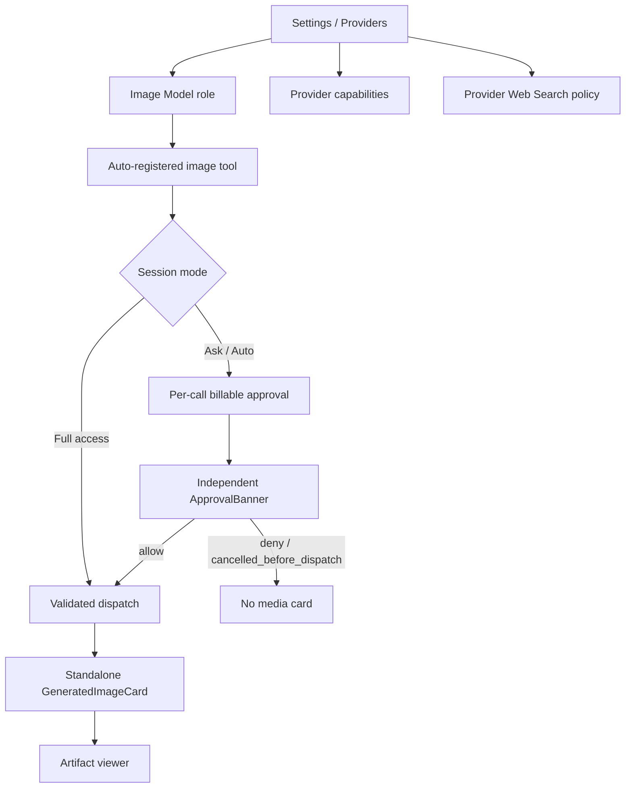

# 图片生成与 Provider Tools UI 设计

> 日期：2026-08-08
> 状态：Approved for implementation（Revision 2 双红队复审 GO；Revision 6 正式动效合同）
> Revision：6（Image Model 自动注册；Full access 不显示 billable approval；扫描织网生成态）
> 平台：Web 与 Desktop 共用；TUI/ACP 采用同一状态合同的降级呈现

## 1. 设计方向

采用“内容优先的媒体画布 + JCode 工作台”的组合：开始生成后，媒体卡使用紧凑扫描织网占位和内容内联，但沿用 JCode 的主题 token、按模式生效的工具审批与 Artifact 工作流，不复制一张大白页。

视觉重点只有三个：

1. 用户能在调用前看清 provider/model/是否计费；
2. 等待审批只显示独立 ApprovalBanner；generating/saving 才显示不伪造百分比的紧凑媒体占位；
3. 成功图片既留在对话语境里，又成为可下载、可回放的 Artifact。

## 2. 信息架构



Desktop 不增加独立设置文件；它使用同一 React dist 和 API。TUI/ACP 不复制 UI 状态，只映射 phase 与 ArtifactRef。

## 3. Settings：Model Roles

`Settings > Providers` 顶部现有 Small Model 旁新增 Image Model。

Image Model picker 每行包含：

- provider display name / model name；
- `可生图`，与现有 `可看图` 明确分开；
- availability：支持 / 未知 / 不支持；
- capability-specific endpoint 摘要，不显示 credential。

行为：

- 只列 resolver 的 image catalog；image-input-only 不出现；
- `supported` 可选；选择本身不会调用供应商或产生费用；
- 未选择时显示“未设置 — 图片工具不会提供给 Agent”；
- 选择有效 Image Model 后，`generate_image` 自动进入 normal-mode 工具目录；没有 provider image policy，也没有当前会话的 image override；
- Image Model 独立于 Chat Model/provider。切换聊天模型不会改变图片路由，用户可以使用 Kimi 聊天并由 BigModel/千问生成图片。

自定义 OpenAI-like provider 的 Advanced 区域新增“图片生成 API”：

```text
Protocol          [ OpenAI Images           v ]
Image base URL    [ https://.../v1            ]
Image models      [ model-id ] [ + Add model ]
Asset hosts       [ cdn.example.com ] [ + Add ]
                  This is independent from Chat /models.
```

缺少其中任何一项时不显示“可生图”。

Asset hosts 为空时只接受 base64 或 endpoint 同 origin URL；UI 不从运行结果自动学习 CDN host。高级输入只接受 exact host 或受限 `*.example.com`，并在保存前显示规范化结果。

## 4. Settings：Provider Capabilities

每个 provider card 在 Header 与 Models 之间加入 Capabilities section：

| Row | 主内容 | 控件 |
| --- | --- | --- |
| Chat protocol | Chat Completions / Responses / Formula | resolved badge |
| Vision input | 可看图 | status |
| Image generation | 可用模型数、当前是否承担 Image Model 角色、实际调用可能消耗额度 | Select model / status；无 policy switch |
| Provider Web Search | MCP / Responses / Formula | policy switch |
| Other built-ins | extractor/interpreter/search | status |
| Recommended MCP | Vision/Reader/ZRead | configure |

Provider Web Search 等 provider-bound tools 的 availability 与 policy 必须是两个独立视觉对象，不能把“已接入”和“已开启”混为一谈；它们还必须跟随当前 Agent/Chat Model 的 provider exact adapter，不能从另一份已配置 provider 跨 provider 注入。图片生成不显示 policy：其 availability 决定模型是否可选，`image_model` selection 决定工具是否注册。产品不提供 capability test；adapter contract test 与 live smoke 属于发布流程。认证、网络或额度错误只在用户明确批准的真实调用上显示安全分类。

## 5. Composer

Composer 不显示 Tools 按钮、provider capability popover、图片模型状态或会话级工具 checkbox。这里是输入与运行模式入口，不重复承载 Provider Settings。

- Image Model 只在 Settings 选择；有效模型会自动注册图片工具；
- Provider Web Search 只由当前 Chat Model 的 exact provider capability、该 provider 的 policy 与凭证决定；
- 切换 Chat Model 时重新解析其 exact provider，绝不能从另一份已配置 provider 跨 provider 注入 Search；
- Plan mode 直接从工具目录省略这些工具，不改写全局 provider policy；
- 产品不提供 task-scoped `/tool-overrides` API，也不使用 localStorage 保存隐藏开关；
- Ask for approval / Auto 下，真正的图片生成与外部搜索调用显示结构化费用审批；Full access 不生成 approval item。

## 6. Billable approval

Ask for approval / Auto 下，生图审批不复用通用 “Allow all”，只有结构化 option `deny` / `allow_once`。Full access 不渲染这张卡，也不发送 approval event。审批卡明确显示：

```text
生成 1 张图片？
BigModel · CogView-3-Flash · 1024×1024
将把本次 prompt 发送给外部供应商，可能产生费用。

[拒绝]                                      [仅本次]
```

Approval WS/API/reconnect payload 必须包含 `options`、结构化费用摘要和 terminal `resolved_option_id`。Web runtime 必须实现 `resolveApprovalOption` endpoint；`billable_external` 若 host 没有 option action 就 fail closed，禁止 core 将 custom option boolean-fallback 成普通 approve。费用摘要显示 provider/model/size/count，不把完整 prompt args塞进审批 DOM。

## 7. Standalone GeneratedImageCard

### 7.1 分组合同

生图调用在初始 `tool_call` 带 `surface='standalone'`，是 Activity group 的硬边界。内部 occurrence 此时仍是 `phase='queued'`，但 Web/Desktop renderer 不渲染 GeneratedImageCard；只有进入 generating/saving 或可展示的 dispatch 后终态时才输出媒体卡。它不能被压缩成通用 CompactToolRow。

共享 ToolCall 保留数据语义；standalone renderer 自己绘制整个 card，不显示通用 header/chevron/body frame。

分组算法精确定义：standalone tool 不参与 batch pull；遇到它先关闭前一个 Activity group，原位输出 standalone，再让后续工具开启新 group。`Thread` 在 `isStandaloneTool` 分支直接调用 registry renderer，不经过通用 ToolCallCard。至少测试 `read → image → execute`、同 batch 的 `read + image + execute`、approval 位于 image 前后三种序列。

### 7.2 几何

- generating/saving 按比例使用紧凑宽度：竖图 `12rem`、方图 `16rem`、横图 `18rem`，同时受容器 `100%` 上限约束；
- succeeded 图片最大宽度 `min(18rem, 100%)`，竖图最大高度 `22rem`，使用 `object-fit: contain` 完整展示，不裁切；
- 圆角使用 JCode radius token，视觉约 18px；
- P0 严格单图；多图网格和 partial success 在请求/result 合同支持 per-item index 后再开放；
- 图片 `decode()` 完成后淡入，避免半解码闪烁。

### 7.3 状态

`queued`

- 仅作为 reducer、replay 与费用审计的内部 lifecycle；
- Web/Desktop 不渲染 GeneratedImageCard、媒体占位或预留比例面；
- 等待态与“尚未请求供应商”由独立 ApprovalBanner 表达；
- `approval_denied` 或 `cancelled_before_dispatch` 的 terminal occurrence 也不渲染媒体卡。

`generating`

- 紧凑占位中央使用扫描织网：8 条横轨、8 条纵轨和 6 个节点按不同相位逐次接通，完整周期为 `3.2s`；
- 视觉面不显示状态文字、elapsed、provider 或 model，不显示虚假百分比；
- 仅为辅助技术保留屏幕阅读器状态文本。

`saving`

- 沿用 generating 的紧凑占位几何；
- 横轨、纵轨和节点全部切换到独立的 `4.6s` 收束 keyframes，缩小变化范围并保持更完整的网格，表达 provider 已返回且正在落盘；不能只延长 generating 动画；
- 屏幕阅读器仍报告“正在保存”，视觉面不增加文案。

`succeeded`

- 图片在最大 `18rem` 的媒体面中以 `contain` 完整显示；
- 图片解码完成后整面可点击：Desktop 使用现有 hardened Artifact action 打开系统图片查看器，Web 以 authenticated Blob URL 打开独立标签页；
- hover/active 提供轻微缩放反馈，键盘焦点有明确内描边；
- 左下 `编辑` 仅 adapter 支持 image edit 时出现；BigModel P0 隐藏；
- 图片卡不显示 Download、Open Artifact、Reveal 或其他悬浮操作按钮；下载、打开 Artifact、Desktop Reveal 与 Share 统一留在右侧 Artifact 面板；
- P0 不显示 Regenerate/Edit。后续只有在 tool-level action API、参数来源、费用审批和 lineage 全部落地后才开放，不能复用 assistant message regenerate。

`failed`

- provider 已 dispatch 后显示紧凑错误卡；
- auth/quota/safety/rate-limit/download/persist 分类；
- auth 提供 Settings 深链；
- persist/uncertain failure 明确“可能已计费”，P0 不显示 Retry/Regenerate；只允许打开诊断或刷新状态；

`cancelled`

- `approval_denied` / `cancelled_before_dispatch` 不渲染媒体卡；真正 dispatch 后的取消显示 `已停止`；
- 可创建一个新的生成请求；旧调用保持审计记录。

### 7.4 动效与无障碍

- 扫描织网层 `aria-hidden`；轨道和节点只改变 `transform` 与 `opacity`；
- `prefers-reduced-motion` 关闭动画；generating 保留局部接通的静态网格，saving 显示完整归位的静态网格，两者不能只靠颜色区分；
- `aria-busy` 只标记媒体面；隐藏 `role=status` live region 与该媒体面为 siblings，不能放入 busy subtree；
- 状态不能只靠颜色；
- alt 使用有界标题/prompt preview，不放完整敏感 prompt；
- 成功图片整面使用可聚焦 button 语义，label 为“在新窗口中打开图片”；hover actions 在 `:hover`、`:focus-within` 与 touch/coarse pointer 永久可见；目标至少 44px。

## 8. Artifact viewer

Managed image record 增加 Storage、尺寸、格式、provider/model、lineage 与 shareable。

图片 viewer controls：

- Fit；
- 1:1；
- zoom + / −；
- zoom 后 pan；
- fullscreen；
- Desktop Open / Reveal；
- Share 仅 `shareable=true` 时显示。

键盘：`+`、`-`、`0`、Escape。加载并 decode 成功后调用 per-artifact `markViewed(taskID, artifactID, revision)`；列表加载不能把整会话全部标已读。

响应式：

- ≥1100px：docked 560px，用户可拖动；
- 760–1099px 或 200% zoom：右侧 overlay sheet，宽 `min(92vw, 640px)`，focus trap + restore；
- viewer <520px：左侧 168px 列表改为顶部横向 thumbnail strip/抽屉；
- fullscreen 始终不依赖主 layout 宽度。

Breakpoint/overlay 切换由 `App/RightPanel` 负责，不塞进 viewer。Docked resize handle 使用 `role=separator`、方向键和数值边界；overlay 是真正 dialog，提供 focus trap、Escape、关闭后 focus restore。触摸设备提供非拖拽的宽度/关闭控件。

P0 lineage 只做 breadcrumb：`Variant of …` + 来源消息；关系图/对比属于 P1。

## 9. TUI 与 ACP

TUI：

```text
◌ Waiting for approval · CogView  # Ask / Auto only
◒ Generating · 8.4s
◒ Saving
✓ Image generated · JPEG · 1024×1024 · 51 KB
  JCode local: /Users/.../.jcode/artifacts/<session>/images/<id>.jpg
```

remote session 追加 `stored on the JCode engine, not the remote workspace`。

TUI 不提供 `/tools image|search on|off`。图片生成跟随全局 `image_model`；Provider Web Search 跟随当前 Chat Model exact provider 的 provider policy。两者都在 normal mode 解析，Plan mode 直接省略。

ACP 不为 `image_generation` 或 `web_search` 暴露 Session Config Options。图片工具跟随全局 Image Model；Provider Web Search 跟随当前 Chat Model exact provider 的 provider policy。结果始终发送同一 metadata 文本和合法的 JCode engine 本机路径，`rawOutput` 另带有界结构化 metadata；只有握手明确协商 shared filesystem 才发送 file resource link。未协商时不发不可访问的 `file://`。P0 不要求 inline base64。

## 10. 组件落点

`jcode-ui-core`：

- `ToolCall.surface`、`ToolCall.phase`、`ToolCall.artifacts`；
- `ToolCall.operationID`、`ToolCall.outcome`、`ToolCall.errorCode`；`phase=terminal` 不替代具体 outcome；
- `ArtifactRef`；
- standalone group boundary；
- approval opaque option round-trip。

Store reducer 使用单调 phase rank：`queued(0) < generating(1) < saving(2) < terminal(3)`；terminal 不回退，重复事件幂等。未知 ToolCallID 的 progress 不创建卡片，而触发一次 task operation refresh。ArtifactRef 按 ID 去重。Replay 对账为 terminal operation > 同 OperationID 且可验证 Artifact > terminal tool result > non-terminal operation；后者显示 `uncertain`。`agent_done` 不能把它改为 done/succeeded。Terminal event 必须带 typed outcome/errorCode，UI 不解析错误字符串。

`jcode-ui`：

- `GeneratedImageCard.tsx`（纯展示）；
- generated-image styles；
- ModelInfo output modalities。

Web host：

- `GeneratedImageToolRenderer.tsx`：authenticated fetch、object URL lifecycle、actions；
- store/WS/replay phase + artifacts；
- Settings 子组件；
- Artifact viewer zoom/responsive；
- runtime `resolveApprovalOption`。

Desktop 无独立组件。

## 11. 发布约束

项目规则要求 `packages/jcode-ui-core` 与 `packages/jcode-ui` 是 npm 发布源且消费者使用 registry range；但当前 checkout 的 `web/package.json` 和 `packages/jcode-ui/package.json` 实际仍是 `workspace:*`。这是一项合并前拓扑迁移，不得一边按 workspace 做 E2E、一边宣称发布安装可用。

生产接线必须：

1. 完成 package tests/build；
2. 发布 core；
3. 更新 jcode-ui core 依赖并发布 jcode-ui；
4. 升级 Web consumer 与 release-age excludes；
5. 重新 build Web embed。

若没有 npm 发布授权或 OTP，只能完成 package source/tests；不能宣称生产 Web/Desktop E2E。真正 E2E 前必须先得到用户授权完成发布链，或由用户明确批准一个不发布的临时验证分支；临时 workspace 验证不能进入最终配置。

## 12. 视觉与行为验收

- 1440×900、1024×768、760px、200% zoom；
- light/dark/reduced-motion；
- standalone 卡与 read/execute 相邻、同 batch、approval 穿插时仍不进入 Activity；
- queued 不产生 Web/Desktop 图片卡；独立 ApprovalBanner 拒绝后 provider dispatch=0，`approval_denied` / `cancelled_before_dispatch` 终态也不产生媒体卡；
- generating/saving 占位分别按竖图 `12rem`、方图 `16rem`、横图 `18rem` 收敛；正式动画为 8 横轨 + 8 纵轨 + 6 节点，generating `3.2s`，saving 使用独立 `4.6s` 收束；成功图片不超过 `18rem`、竖图不超过 `22rem` 高且使用 `contain`；reduced-motion 下生成/保存静态几何可区分，live region 位于 `aria-busy` 媒体面的 sibling；
- progress 重复/乱序幂等；刷新从 Artifact entries 恢复 succeeded；
- 单图、所有错误分类、取消、uncertain；P0 不验收四图/partial；
- approval options/reconnect/resolved option ID 原样回传；缺 handler 时 fail closed；
- Composer 无 Tools 入口；Plan mode、Chat Model exact-provider 交集与 provider policy 热更新正确；Image Model 选择后自动注册且无图片 checkbox；
- managed download/Open/Reveal/shareable 与 per-artifact viewed；
- object URL 在换图/卸载时 revoke；
- 无 API key、signed URL、base64 进入 DOM data attributes、Redux persistence 或日志。
