# JCode Provider Tools 与图片生成 PRD

- 状态：Approved for technical design（Grok 4.5 复审 GO，2026-08-08）
- 日期：2026-08-08
- 目标版本：P0 capability foundation + P1 provider rollout
- 适用端：TUI、ACP、Browser Web、Tauri Desktop
- 相关文档：`internal-doc/artifacts-prd.md`、`internal-doc/artifacts-design.md`
- 评审记录：`internal-doc/provider-tools-image-generation-prd-review.md`
- P0 实现基线：`image-generation-architecture.md` Revision 6 与 `image-generation-ui-design.md` Revision 6。选择有效 `image_model` 即在 normal mode 注册工具；图片生成没有 provider/session 开关。Ask for approval 与 Auto 模式仍逐次批准，Full access 作为现有会话级预授权不再弹单次费用确认；durable operation、额度和 dispatch-time runtime 校验不受模式影响。

## 1. 决策摘要

1. **能力按“Provider profile + 凭证类型 + Base URL + 模型”判定，不能按品牌猜测。** 同一个 GLM 模型经阿里 Token Plan 路由时，不能自动套用 BigModel 的搜索或图片 API。
2. JCode 明确区分三类工具：
   - JCode 本地工具，例如 `read`、`execute`、`generate_image`；
   - Provider server-native tool，例如千问 Responses Harness、Kimi `$web_search` / Formula；
   - Provider 提供的 MCP 服务，例如 BigModel Coding Plan 的搜索 MCP、视觉理解 MCP。
3. P0 新增统一的、会产生外部调用和文件写入的 `generate_image` 工具。它调用独立图片服务 API，把结果立即持久化为 managed Artifact；不把图片模型伪装成 ChatModel。
4. `image_model` 是独立于当前聊天模型的全局模型角色。用户可以用 Kimi 聊天，同时让 `generate_image` 使用 BigModel 或千问图片模型；只要所选图片模型能精确解析到可用 adapter/runtime，JCode 就注册图片工具，不再叠加 provider 或 session 图片开关。
5. Provider-bound 能力（例如 Web Search）必须跟随当前 Agent/Chat Model 的 provider exact adapter；配置中存在另一家 provider 不能把其搜索能力跨 provider 注入当前会话。Provider-native 搜索在当前聊天模型 adapter 层或其 exact MCP adapter 层完成，不注册成会被 Eino ToolsNode 本地执行的普通 function tool。
6. 生成图片统一存入 `config.ConfigDir()/artifacts/<session-id>/images/`。Web/Desktop 通过 opaque Artifact ID 展示；TUI 和 ACP 指向同一份实际文件，不复制第二份结果。
7. Desktop 不新增另一份原生配置文件。Tauri 继续复用 Web Settings，并写同一份 `~/.jcode/config.json`。
8. 内部 operation 采用 `queued -> generating -> saving -> succeeded | failed | cancelled | uncertain` 状态机；Web/Desktop 的 queued 由独立 ApprovalBanner 表达而不渲染图片卡，生成/保存中才出现紧凑占位，成功图片整面可点击打开独立查看器，卡上不叠加操作按钮。
9. 当前聊天响应直接携带 assistant image output、图片编辑谱系和自动跨供应商降级均不属于 P0。

## 2. 背景与问题

JCode 当前把所有模型供应商统一接到 OpenAI-compatible Chat Completions，并把 Eino tools 全部编码为 `type=function`。该抽象适合本地工具调用，但无法完整表达以下能力：

- 千问 Token Plan Harness 只在 Responses API 中出现；
- Kimi 的 `$web_search` 使用 `builtin_function`，K3 又优先推荐 Formula API；
- BigModel Coding Plan 的联网搜索是远程 MCP，视觉理解是本地 MCP；
- 千问与 BigModel 的图片生成使用独立服务端点，不是 Chat Completions；
- 当前 runner、session 和 transports 只可靠传递文本工具结果，不能保存和展示生成媒体的结构化引用。

与此同时，JCode 已经有 Web/Desktop Artifact 面板和图片 Viewer，但现有 Artifact 合同只接受工作区文件，且明确排除了 TUI/ACP。这次需求需要一个增量合同：生成媒体可以存放在 JCode 管理目录，并通过统一引用向四个 transport 交付。

## 3. 术语与产品边界

| 名称 | 含义 | 本 PRD 处理方式 |
| --- | --- | --- |
| Image input / 视觉理解 | 模型读取图片或视频 | 保留现有 attachment 能力；BigModel Vision MCP 归 MCP 集成 |
| Image output / 图片生成 | 根据文本或参考图产生新图片 | 统一 `generate_image` 工具 + ImageGenerator adapter |
| 图片编辑 | 以已有图片为参考生成新 revision | P1；首个候选为 Wan 2.7，不覆盖原文件 |
| Provider-native tool | 供应商在模型协议内部执行的工具 | Chat/Responses adapter 吸收生命周期，只向 runner 输出最终文本、来源和 usage |
| Provider MCP | 供应商提供的标准 MCP server | 复用 JCode MCP client；通过 provider credential reference 避免复制密钥 |
| Workspace Artifact | 内容位于当前工作区的既有 Artifact | 保持现有合同 |
| Managed Artifact | 内容位于 JCode 管理目录的生成媒体 | 本 PRD 新增 `storage_kind=managed` |

BigModel 的“视觉理解 MCP”不是图片生成；Kimi 的图片/视频能力目前也是输入理解，不是图片输出。UI 必须使用不同标签，禁止把“支持看图”显示成“支持生图”。

## 4. 仓库现状

### 4.1 可复用能力

- Web 与 Desktop 复用同一 React 产品 UI，Desktop 不需要独立设置页。
- Provider API 已对密钥和敏感 headers 做遮罩，配置目录/文件权限分别为 `0700`/`0600`，并采用原子替换。
- Model registry 已有 `Modalities.Input/Output`，并已包含部分 `output:image` 模型。
- JCode 已有 local/HTTP/SSE MCP 配置、OAuth、启停和状态 UI。
- Artifact Service 已有会话登记、MIME 识别、下载、图片预览、Desktop Open/Reveal、Cloud Share 等基础。
- ACP SDK 已能表达 image block 与 resource link；TUI 可以稳定展示绝对路径和元数据。

### 4.2 必须修复的抽象缺口

- Agent Chat model picker 必须要求 `output:text && tool_call`；Image model picker 必须要求 `output:image`。不能继续用 `ToolCall` 代替 workload 分类。
- `ProviderConfig` 没有协议、built-in tool policy、图片服务或能力验证字段。
- `WithTools()` 当前只构造 OpenAI function tools，call-time tools 还会替换预绑定 tools；因此 native tool 不能塞入同一个列表。
- `toEinoMessage()`、stream decoder 和 runner 会丢弃 assistant multimodal output；P0 不依赖该路径。
- `ToolResultEvent` 只有字符串 `Output`，需要增加兼容的 `Artifacts []ArtifactRef` 字段。
- 当前 Artifact 只接受 workspace-relative path；managed storage 是 Artifact v2 的先决增量。
- Provider “测试连接”只有 `/models`，不能证明搜索或生图能力真实可用。

## 5. 官方能力与 2026-08-08 实测

### 5.1 能力矩阵

| Provider profile | 联网搜索 | 图片生成 | 图片编辑 | P0 决策 |
| --- | --- | --- | --- | --- |
| Alibaba Token Plan Personal | 指定 Qwen 模型通过 Responses Harness 支持 | Token Plan 专属同步 multimodal-generation；Wan 2.7 / Pro | Wan 2.7 文档支持参考图编辑 | 文生图 adapter 已实现；图片编辑留 P1；maintainer live smoke 属于发布流程 |
| BigModel Coding Plan | 官方远程 MCP `web_search_prime` | 同一已配置凭证实测可调用 CogView 图片 API | 公开 API 未发现编辑端点 | P0 支持搜索 MCP preset + 图片生成 |
| BigModel General API | Chat native `web_search` 或独立 search API | `/images/generations` | 公开 API 未发现编辑端点 | 与 Coding Plan profile 分开，不自动混用额度 |
| Moonshot/Kimi General API | K3 Formula；`$web_search` builtin function | 未发现公开 Images endpoint | 未发现 | P0 支持官方搜索；生图 UI 显示 unsupported |
| Kimi Coding Plan | 官方 Kimi CLI 宿主搜索实测可用 | 未发现公开 Images endpoint | 未发现 | 只在稳定公开协议/官方 SDK 路径上接入，不依赖猜测 endpoint |

### 5.2 千问 Token Plan

官方个人版文档当前列出的 Harness 能力包括：

- `qwen3.8-max`：`web_search`、`web_extractor`、`code_interpreter`、`t2i_search`、`i2i_search`；
- `qwen3.7-max`：前三项；
- `qwen3.7-plus`：五项。

这些 Harness 只通过 Responses API 触发，Chat Completions 不会触发。图片生成走独立的北京 multimodal-generation endpoint，并返回需要立即下载的临时 URL。

本机早期配置的 `alibaba-token-plan-cn` 凭证曾在错误的通用 DashScope/Responses 路径上返回 HTTP 401；这既不能推导供应商不支持，也不能作为产品状态。当前设计按 Token Plan 官方独立多模态 endpoint 实现 adapter；认证失败只在用户批准的真实调用上显示安全分类，Settings 不发计费 probe。

### 5.3 BigModel

本机实测：

- Coding Plan `/models` 返回 HTTP 200；
- 官方远程搜索 MCP 完成 `initialize`，服务端返回 `mcp-web-search-prime`；
- `tools/list` 返回工具 `web_search_prime` 及完整 input schema；
- 一次 `tools/call` 真实返回 `https://www.j-code.net/` 的标题、URL、摘要和引用标识；
- 独立通用 `/web_search` API 使用同一 Coding Plan 凭证返回 429“余额不足或无可用资源包”，说明 Coding Plan MCP 额度和通用 API 额度不能混为一谈；
- Chat Completions 中加入 native `web_search` 后虽然返回文本，但没有搜索结果/来源证据，不能判为成功；
- `cogview-3-flash` 同步生图返回 HTTP 200，下载后为 1024×1024 JPEG。供应商 URL/文件名被保存为 `.png` 时，实际 magic bytes 仍为 JPEG，因此实现必须 MIME sniff 并按真实格式决定扩展名。

用户提供的视觉 MCP 是本地包 `@z_ai/mcp-server`，基于 GLM-4.6V，提供 `image_analysis`、UI 转 artifact、截图 OCR/诊断、技术图和数据图理解、UI diff、视频分析等工具。它属于“推荐 MCP 集成”，不能作为 `generate_image` 的实现。

### 5.4 Kimi

官方 Kimi API 文档中，`$web_search` 的声明为：

```json
{
  "type": "builtin_function",
  "function": { "name": "$web_search" }
}
```

模型先返回 tool call；调用方把 arguments 原样作为 `role=tool` 结果回传后，由 Kimi 执行搜索并输出最终回答。搜索结果会占用输入 tokens，且真正触发时另行计费。K3 官方优先推荐 Formula API 的标准 function tool 通道。

本机 `kimi-for-coding` `/models` 返回 HTTP 200。通过官方 Kimi CLI 强制单次 `WebSearch`，观察到真实 assistant tool call、约 4.6 KB tool result 和最终 assistant 文本，证明当前 Coding Plan 凭证具有宿主搜索能力。直接猜测 Coding endpoint 的未公开 request schema 不构成可维护集成；P0 只能采用公开协议或官方 SDK/CLI 所暴露的稳定接口。

公开模型/API 文档只描述图片/视频输入理解，未提供图片生成或编辑 endpoint。因此 Kimi provider 下“图片生成”必须显示 unsupported，除非用户另选全局 `image_model`。

## 6. 用户目标与非目标

### 6.1 用户目标

- 在 Settings 中看清每个 provider/model 是支持看图、生图、本地 function tools、原生搜索还是 MCP。
- 在 Provider Settings 中控制 Provider Web Search 等 provider-bound 能力；切换聊天模型后只使用新模型所属 provider 的 exact adapter。
- 直接要求 Agent 生成图片，由 Agent 调用 `generate_image`，生成过程和完成结果像 ChatGPT 一样出现在对话中。
- Web/Desktop 可预览、下载、编辑、重新生成和在 Artifact 面板管理图片。
- TUI/ACP 得到同一文件与同一 artifact metadata，不产生不可追踪的临时 URL 或第二份副本。
- 在一次用户明确批准的真实调用失败时，看到认证失败、额度不足、模型不支持等安全、可行动的错误分类；Settings 不发 capability probe。

### 6.2 非目标

P0 不包含：

- 把所有 provider 私有工具统一成同一种 JSON 字段；
- 让普通聊天模型 picker 接受 output-image-only 模型；
- 解析聊天响应中供应商原生 assistant image part；
- 自动把用户 prompt 发给另一个 provider 作为 fallback；
- Kimi 图片生成、BigModel 图片编辑；
- 终端 Sixel/Kitty 图片协议渲染；
- 自动安装本地 `npx` MCP 包；
- 将生成图片默认复制进 git workspace；
- 后台批量调用 Token Plan。Token Plan 个人版仅用于交互式编程/Agent 场景。

## 7. 核心体验

### 7.1 Settings：Provider 能力

Desktop 与 Browser Web 共用 `Settings > Providers`。每个 provider 详情页增加“能力”区域：

| 行 | 展示与行为 |
| --- | --- |
| Chat protocol | `Chat Completions`、`Responses`、`Formula` 或 provider-specific；`auto` 显示最终解析结果 |
| 视觉输入 | 支持/不支持；沿用 attachment 能力 |
| 图片生成 | 支持模型数、当前是否承担全局 Image Model 角色；跳转选择模型，不提供 policy switch |
| Provider Web Search | provider 级独立开关；显示机制（Responses / Formula / MCP）和可能计费提示 |
| 其他 built-ins | 按 capability manifest 列出，如 web extractor、code interpreter、image search |
| 推荐 MCP | BigModel Vision/Reader/ZRead 等 preset；明确标为 MCP，不冒充 native tool 或图片生成 |

Provider-bound tools 只展示两个用户能直接理解和操作的维度：

- availability：`supported | unsupported | unknown`，来自随版本发布的精确 capability manifest；
- policy：`enabled | disabled`，Provider Web Search 等可能计费的 provider-bound 能力默认 disabled。

图片生成不使用这条 policy 轴。它的产品状态只有“图片模型是否可选/是否已选为 `image_model`”；选中且 runtime 可解析时，`generate_image` 自动进入 normal-mode 工具目录。Ask for approval 与 Auto 模式由 `billable_external` 逐次审批，Full access 对完整且校验通过的 billable intent 直接预授权。

Settings 不提供“能力测试”“未测试”“重新测试”等产品状态，也不会为配置验证自动生成一张计费图片。供应商 contract、adapter contract test 与 maintainer live smoke 属于研发/发布门，不转嫁给普通用户。选择已接入的 `image_model` 不产生外呼；真正生成可能产生费用，认证、额度或网络错误在实际调用上以安全错误分类呈现。Full access 的模式说明必须明确“不再弹审批”。

以下真值表只适用于 Provider Web Search 等 provider-bound tools，不适用于 `image_generation`：

| Availability | Policy | Settings / runtime | 是否可执行正常调用 |
| --- | --- | --- | --- |
| `unsupported` | 任意 | 显示“无 JCode 适配器”，不能开启 | 否 |
| `unknown` | 任意 | 显示“尚未接入”，引导配置受支持的显式 endpoint | 否 |
| `supported` | `disabled` | Settings 显示关闭；所有任务均不注入 | 否 |
| `supported` | `enabled` | 当前 Chat Model 属于该 exact provider 时自动注入 | 是；仍受调用上限约束，Ask for approval / Auto 逐次审批，Full access 不询问 |

### 7.2 Settings：模型角色

在现有聊天模型配置旁增加 `Image Model`：

- Chat Model picker：只列 `output:text && tool_call`；
- Image Model picker：只列 `output:image` 或 capability manifest 明确声明 `image_generation` 的模型；
- Picker 只允许选择 availability=`supported` 的 Image Model；不展示运行时“测试”徽标；
- 标签分别为“可看图”“可生图”“可编辑”，不再使用含糊的单个图片图标；
- 当前 chat provider 不支持生图时，仍可选择另一个 provider 的 Image Model；
- 保存选择本身不调用供应商；所选模型、凭据和 exact adapter/runtime 均可解析时，`generate_image` 自动注册到所有 normal-mode transport；
- 没有选择或所选 Image Model 不可用时，`generate_image` 不注册，Settings picker 显示原因并引导修复；Composer 不提供第二个图片开关。

### 7.3 Composer：不重复暴露工具配置

Composer 不显示 Tools 按钮、provider capability popover、图片模型状态或 task/session checkbox。用户只在 Provider Settings 开关 Provider Web Search，只在 Image Model picker 选择图片模型。

切换 Chat Model 时，runtime 重新解析新模型所属 provider 的 exact capability 与 policy；绝不能因为 config 中另存了其他 provider 就跨 provider 注入。搜索开关语义是“允许该 provider 的聊天模型按需调用，并允许把本轮必要内容交给该供应商搜索服务”，不是“保证每轮搜索”。`image_model` 路由独立，不随 Chat Model 切换而改变。

### 7.4 图片生成卡片

状态机：

```mermaid
stateDiagram-v2
    [*] --> queued
    queued --> generating: "approval granted + exactly one request dispatched"
    generating --> saving: "provider result available"
    saving --> succeeded: "verified + atomic persist + artifact register"
    queued --> cancelled: "denied or cancelled; no provider request"
    generating --> cancelled
    generating --> failed
    saving --> failed
```



交互规范：

- `queued`：保留为 reducer/replay/审计状态；Web/Desktop 不渲染 GeneratedImageCard 或比例占位，等待批准只由独立 ApprovalBanner 显示；
- `generating`：按比例使用竖图 `12rem`、方图 `16rem`、横图 `18rem` 的紧凑占位；中央扫描织网由 8 条横轨、8 条纵轨和 6 个节点组成，以 `3.2s` 周期从不同相位逐次接通；视觉面不显示文字、耗时、provider/model 或虚假百分比，辅助技术仍收到状态；
- `saving`：沿用同一紧凑占位；横轨、纵轨和节点全部切换到独立的 `4.6s` 收束 keyframes，降低位移幅度并保持更完整的网格，不能只延长 generating 动画；视觉面不增加文案；
- `succeeded`：图片交叉淡入，最大宽度 `min(18rem, 100%)`、竖图最大高度 `22rem` 且 `contain` 完整展示；整面点击在 Desktop 打开系统图片查看器、Web 打开独立 Blob 标签页；图片卡不显示 Download、Open Artifact 或 Reveal 按钮，这些管理操作仅保留在 Artifact 面板；
- `failed`：provider 已 dispatch 后显示紧凑错误卡，包含认证、额度、安全拦截、下载校验、超时等分类；认证错误提供 Settings 深链；P0 不提供会导致再次计费的 Retry；
- `cancelled`：`approval_denied` 或 `cancelled_before_dispatch` 不渲染媒体卡；真正 dispatch 后取消才显示“已停止”；
- `uncertain`：provider dispatch 后缺失可确认终态，显示“状态未知 · 可能已计费”，禁止普通 Retry/Regenerate；
- 扫描织网动画只改变 `transform` 与 `opacity`；`prefers-reduced-motion` 下关闭位移，generating 使用局部接通的静态网格，saving 使用完整归位的静态网格，两者不能只靠颜色区分；视觉动画 `aria-hidden`。隐藏 `role=status` live region 必须位于 `aria-busy` 媒体面的 sibling，不能嵌在 busy subtree 内而延迟播报；
- 默认 `focus=false`，成功后只更新 Artifact 未读点，不抢开右侧面板；
- 不能复用 `Message.images`，因为它承载 base64 输入附件。新增 `GeneratedImageCard` tool renderer，以 artifact ID 加载内容。

Edit、Regenerate、tool-level retry、reference lineage 均为 P1。它们只有在专用 action API、费用审批与 operation recovery 合同落地后才显示；P0 不复用 assistant-message regenerate。

## 8. 配置合同

建议保持 `config.json` 向后兼容，新增字段均为 optional：

```json
{
  "model": "kimi-for-coding/k3",
  "image_model": "zhipuai-coding-plan/cogview-3-flash",
  "providers": {
    "alibaba-token-plan-cn": {
      "api_key": "***",
      "protocol": "responses",
      "provider_tools": {
        "web_search": {
          "enabled": false,
          "max_calls_per_turn": 2,
          "max_calls_per_session": 10
        }
      }
    },
    "zhipuai-coding-plan": {
      "api_key": "***",
      "provider_tools": {
        "web_search": {
          "enabled": false,
          "max_calls_per_turn": 2,
          "max_calls_per_session": 10
        }
      }
    }
  },
  "media": {
    "retention_days": 30,
    "max_total_bytes": 2147483648
  }
}
```

对应 Go contract 建议：

```go
type ProviderToolPolicy struct {
    Enabled            bool `json:"enabled,omitempty"`
    MaxCallsPerTurn    int  `json:"max_calls_per_turn,omitempty"`
    MaxCallsPerSession int  `json:"max_calls_per_session,omitempty"`
}

type ProviderConfig struct {
    // existing fields...
    Protocol      string                        `json:"protocol,omitempty"`
    ProviderTools map[string]ProviderToolPolicy `json:"provider_tools,omitempty"`
}

type MediaConfig struct {
    RetentionDays int   `json:"retention_days,omitempty"`
    MaxTotalBytes int64 `json:"max_total_bytes,omitempty"`
}

type Config struct {
    // existing fields...
    ImageModel string      `json:"image_model,omitempty"`
    Media      MediaConfig `json:"media,omitempty"`
}
```

约束：

- `ProviderToolPolicy` 只管理 Web Search 等 provider-bound tools；`image_generation` 不写入该 map。执行机制不入用户配置，完全由 capability resolver 决定；
- 示例中的 provider-bound 计费能力均为出厂默认 `enabled:false`。`enabled:true` 只能来自用户已明确开启后的配置快照；图片费用不靠 enable 开关授权。Ask for approval / Auto 走逐次 `billable_external`，Full access 使用会话模式预授权；
- custom provider 默认 capability 为 unknown。高级用户可声明 workload 和协议，但系统不会通过 model 名称猜测私有 endpoint；
- custom OpenAI-like 图片能力只有在显式保存 `image_endpoint.protocol=openai_images`、独立 Base URL 和至少一个 image model 后才进入图片模型候选；它可以是没有 chat route 的 image-only provider；
- 图片模型只有“可选择”和“已选为角色”两层。保存 endpoint 只增加候选；选择有效 `image_model` 同时固定独立路由并注册 `generate_image`，不创建 provider image policy 或 session image override；
- provider MCP preset 保存 `credential_ref: <provider-id>`，运行时注入密钥，禁止把同一个 key 复制到 MCP headers/env；
- provider 设置保存后，Web/Desktop 当前 engine 安全 rebuild；TUI/ACP 新会话读取新配置。热更新跨进程监听不属于 P0；
- Provider Web Search 等能力直接读取当前 Chat Model exact provider 的全局 policy；不创建 task/session override。图片生成同样没有会话 override。

## 9. 能力模型与 adapter

### 9.1 Capability manifest

在生成 registry 之外维护一层可测试的 capability manifest：

```go
type CapabilityDescriptor struct {
    ID                 string   // web_search, image_generation, image_edit...
    Workload           string   // chat, image_generation
    Runtime            string   // responses_harness, builtin_function, formula, mcp_tool, service_api
    ProviderProfileIDs []string
    CredentialKinds    []string
    EndpointProfiles   []string
    Models             []string
    Billable           bool
    EnforceableCallLimit bool
}

type CapabilityKey struct {
    ProviderProfileID string
    CredentialKind    string
    EndpointProfile   string
    ModelID           string
}
```

模型 registry 的 modalities 只用于基本分类；API 机制、凭证限制和 provider endpoints 由 manifest/adapter 决定。生成脚本不得覆盖人工维护的能力规则。

Capability resolver 必须执行以下算法：

1. 内置 provider map key 解析为固定 `ProviderProfileID`；credential kind 来自该 profile 的配置类型与人工 manifest，不能只凭模型名或 key 前缀猜测，也不依赖产品 capability probe。
2. Base URL 为空时使用 profile 的默认 `EndpointProfile`；用户提供 Base URL 时，先 canonicalize，再与该 profile 的精确 endpoint allowlist 匹配。
3. 精确匹配时形成 `CapabilityKey(profile, credential kind, endpoint profile, model)`；manifest 只有精确匹配该 key 才能给出 `supported` 和唯一 runtime。
4. Base URL 偏离 preset、自建反代或 custom provider 默认形成 `custom:<sha256(canonical-base-url)>` endpoint profile，availability 为 `unknown`，不得继承千问、BigModel、Kimi 的私有 tool/MCP/image endpoint。
5. `image_model` 解析同样走该 key。模型名包含 `CogView`、`Wan` 或 `Qwen-Image` 不能单独触发生图 adapter。
6. Manifest 明确列为不支持的组合返回 `unsupported`；没有精确规则返回 `unknown`，二者都不能静默 fallback。

### 9.2 Chat provider adapters

```go
type SearchPolicy struct {
    Enabled            bool
    MaxCallsPerTurn    int
    MaxCallsPerSession int
}

type SearchRuntime string

const (
    SearchRuntimeResponsesHarness SearchRuntime = "responses_harness"
    SearchRuntimeBuiltinFunction  SearchRuntime = "builtin_function"
    SearchRuntimeFormula          SearchRuntime = "formula"
    SearchRuntimeMCPTool          SearchRuntime = "mcp_tool"
)

type NativeToolPolicy struct {
    Enabled map[string]ProviderToolPolicy
}

type ChatProviderAdapter interface {
    ApplyNativeTools(req any, policy NativeToolPolicy) error
    DecodeProviderMetadata(resp any) (ProviderMetadata, error)
}

type ProviderMetadata struct {
    Sources []SourceRef
    Usage   ProviderToolUsage
}
```

- `SearchPolicy` 是用户可见配置；`SearchRuntime` 只由完整 `CapabilityKey` 解析。一个 key 对一个 capability 最多得到一个 runtime，用户不能编辑 runtime；
- Search resolver 的输入 provider/profile/model 必须先从当前 Agent/Chat Model 锁定；不得遍历其他已配置 provider 寻找可用 Search runtime。独立跨 chat provider 路由只属于 `image_model`；
- Qwen Token Plan adapter 使用 Responses API，识别 `web_search_call` 等 provider events；
- Moonshot adapter 对 K3 采用 Formula；对文档仍支持的模型采用 `$web_search` 两轮协议；
- BigModel Coding Plan search 使用 `SearchRuntimeMCPTool`：通过现有 MCP client 与 provider credential reference 创建标准 MCP-backed Eino tool proxy，模型看到 function schema，ToolsNode 只负责把调用转发到官方 MCP。它不是 Chat Completions 的私有 `web_search` 字段；
- `responses_harness | builtin_function | formula` 的 provider 内部 tool lifecycle 由 adapter 吸收，不能进入 Eino ToolsNode；
- `mcp_tool` runtime 只注册 MCP-backed proxy，禁止 `ApplyNativeTools` 再注入同一搜索；native runtime 则禁止自动拉起搜索 MCP。二者是互斥不变量；
- 本地 function tools、MCP-backed tools 与 native tool policy 必须同时存在且互不覆盖；call-time local tools 不能清掉 native policy；
- 最终统一输出 `SourceRef{Title, URL, Domain}`、调用次数和 usage，供 UI/cost 展示；
- 关闭 capability 时，请求中相关字段必须完全不存在。

Kimi runtime 选择由 manifest 固定，不做协议探测式重试：

| Provider profile / model | Runtime | 状态 |
| --- | --- | --- |
| `moonshotai` / `kimi-k3` | `formula` | P0 首选官方通道 |
| `moonshotai` / manifest 明确列出的 K2.x | `builtin_function` (`$web_search`) | 仅按官方模型清单启用 |
| `moonshotai` / 未知模型 | `none` | availability=`unknown`，不得依次尝试两种协议 |
| `kimi-for-coding` / 当前 Coding models | `none` | 宿主 CLI 已实测有 WebSearch，但 JCode 直连协议在稳定公开 contract 前保持 unknown |

### 9.3 ImageGenerator adapters

```go
type ImageRequest struct {
    Prompt              string
    NegativePrompt      string
    Size                string
    AspectRatio         string
    Quality             string
    Count               int
    ReferenceArtifacts  []string // P1 only
    IdempotencyKey      string
}

type ImageResult struct {
    Images []GeneratedImage
    Usage  ImageUsage
}

type ImageGenerator interface {
    Generate(context.Context, ImageRequest) (ImageResult, error)
}
```

P0 adapters：

- BigModel sync `/images/generations`：`cogview-3-flash`、CogView 4、GLM-Image；
- Alibaba Token Plan sync multimodal-generation：首发 `wan2.7-image` / `wan2.7-image-pro` 文生图；
- async polling adapter 接口保留，但首版优先 sync。Polling 必须响应 context cancellation；
- Kimi 不注册 adapter。

P0 adapter 收到任何 reference artifact 必须返回 `capability_unsupported`；不能静默忽略或把编辑请求当文生图。P1 只有 capability key 明确支持 image edit 时才开放该字段。

provider 返回 URL、base64 或 async task 时，adapter 统一产出受限 byte stream；持久化层负责 MIME sniff、尺寸/像素校验、hash 和原子落盘。不能信任 URL 扩展名或 response 声称的 MIME。

## 10. `generate_image` 工具合同

工具名固定为 `generate_image`，P0 输入：

```json
{
  "prompt": "required string",
  "aspect_ratio": "optional provider-neutral enum",
  "size": "optional validated value",
  "quality": "optional enum"
}
```

规则：

- normal mode only，不进入 Plan mode；
- 只要 `image_model` 已选择、availability=`supported`、凭据存在且 exact adapter/runtime 可解析，就在 normal mode 注册；不读取 provider image policy 或 session image override；
- 属于 approval class `billable_external`，不加入 `noApprovalNeeded`。Ask for approval 与 Auto 不得静默批准；Full access 在 runner 校验 typed intent 与工具身份后直接放行，不产生 ApprovalRequest；
- 需要审批时，每次审批只对应一次 `(provider profile, endpoint profile, model, normalized args, idempotency key)` 请求，选项只有“仅本次/拒绝”；不提供独立的图片 session grant，Full access 是统一会话模式；
- P0 schema 不暴露 `count`，请求固定 1，provider 结果必须恰好 1 张；返回 0 或多张均 fail closed；
- 不默认暴露给 subagent，防止同一 prompt 并发重复计费；
- 不自动跨 provider/model fallback；
- 一个批准动作只生成一个 idempotency key。provider 已接受请求后，网络不确定性不得自动重复提交；只允许用同一个 key 查询/恢复既有 task；
- 多图与 partial success 为 P1；
- P0 tool result 给模型返回短文本和 artifact IDs，不向模型上下文写 base64。把生成像素再次喂给视觉模型属于后续优化。

建议使用 Eino `EnhancedInvokableTool`，在 `ToolOutputPart.Extra["jcode_artifacts"]` 放安全结构化引用；runner 在生成 `ToolResultEvent` 前提取引用。

## 11. Managed Artifact v2

### 11.1 存储布局

```text
~/.jcode/
  artifacts/
    <session-id>/
      images/
        <generation-id>.<sniffed-extension>
      manifest.jsonl
```

- 目录 `0700`、文件 `0600`；
- 先写同目录临时文件，验证并 `fsync` 后 atomic rename；
- 文件名只使用系统生成 UUID，不接受 prompt/provider 文件名；
- `ArtifactRef.RelativeKey` 固定相对于 `~/.jcode/artifacts/<session-id>/`，规范形态为 `images/<generation-id>.<sniffed-extension>`；禁止 `..`、绝对路径、符号链接和用户输入路径。Artifact API 以 session-managed root 解析它；
- managed file 是本地 control-plane 资产。即使当前 workspace 是 SSH/Docker，P0 也不把 provider 返回内容静默写入远端；“复制到工作区”是显式后续动作；
- `retention_days` 和总容量上限只回收未 pin、未 share、非活动 session 的 managed artifacts；任何自动清理都先更新 manifest 状态；
- 生成失败的临时文件可安全删除，不登记 artifact。

### 11.2 Artifact record

```go
type ArtifactRef struct {
    ID               string `json:"id"`
    StorageKind      string `json:"storage_kind"` // workspace | managed
    RelativeKey      string `json:"relative_key"`
    Title            string `json:"title"`
    MediaType        string `json:"media_type"`
    Size             int64  `json:"size"`
    Width            int    `json:"width,omitempty"`
    Height           int    `json:"height,omitempty"`
    SHA256           string `json:"sha256"`
    ProviderID       string `json:"provider_id,omitempty"`
    ModelID          string `json:"model_id,omitempty"`
    ParentArtifactID string `json:"parent_artifact_id,omitempty"`
}
```

JSONL 不保存 base64、签名 URL、API key、provider response body。完整 prompt 已存在于会话/tool args；Artifact manifest 只保存 prompt digest 和有界 preview，避免产生第二份敏感文本事实来源。

现有 Artifact APIs 以 opaque ID 读取 managed content，不向 Web 返回绝对路径。Desktop Open/Reveal 由后端重新验证 ID 后执行。现有 `show_artifact` 的 workspace 语义保持不变。

Artifact 已读状态按 `(artifact_id, revision)` 记录。只有对应 revision 的文本读取或图片/文档 decode 成功后才能标记已读；同 ID 的新 revision 必须重新加载，旧 viewer 的迟到确认以 CAS 冲突拒绝。

### 11.3 事件合同

兼容扩展共享事件：

```go
type ToolProgressEvent struct {
    ToolCallID string
    Phase      string // generating | saving
}

// Optional capability interface; do not add a mandatory method to every
// existing AgentEventHandler implementation.
type ToolProgressHandler interface {
    OnToolProgress(ToolProgressEvent)
}

type ToolResultEvent struct {
    // existing fields...
    Artifacts []ArtifactRef
}
```

- `OnToolCall(generate_image)` 只创建内部 `queued` occurrence，表示仍可能等待审批；不得直接显示 generating，Web/Desktop 此时不渲染媒体卡；
- 审批通过后、恰好一次 provider request dispatch 前，runner 向可选 `ToolProgressHandler` 发送 `generating`；审批拒绝或此时取消会产生 denied/cancelled result，且断言 provider 请求次数为 0；
- provider 结果已可读取、开始下载/校验/落盘时，tool 通过 context 注入的 progress sink 发送 `saving`；该 callback 最终由 runner 转成 `ToolProgressEvent`；
- `tool_result.artifacts` 或持久化的 `artifact_upserted` 完成对账；
- session replay 以 Artifact entries 为事实来源，不能依赖可能丢失的 WebSocket；
- progress interface 和新字段均 optional，旧 handler 和 recorder 仍能消费纯文本最终结果；没有 progress 能力的 Web/Desktop 客户端从独立 approval UI 直接进入 terminal，不显示 queued 媒体占位。terminal 为 `approval_denied` / `cancelled_before_dispatch` 时仍不显示媒体卡；dispatch 后的成功、失败、取消或 uncertain 才按终态呈现。

## 12. Transport 行为

| Transport | 行为 |
| --- | --- |
| Web | 内联 `GeneratedImageCard`；点击图片以 authenticated Blob URL 打开独立标签页；图片卡无悬浮操作按钮，管理操作留在现有右侧 Artifact 面板 |
| Desktop | 完全复用 Web 卡片/Settings/Viewer；点击图片通过 hardened Artifact action 打开系统图片查看器；图片卡无悬浮操作按钮，不另存配置 |
| TUI | 显示生成状态、最终“JCode 引擎本机路径”、MIME、尺寸和字节；remote workspace 时明确它不是远端工作区路径；不内联 base64，不强制终端图片协议 |
| ACP | 始终发送文本路径和 artifact metadata；只有客户端协商 `shared_filesystem=true` 时提供 `file://` resource link；声明支持 inline image 且图片不超过 2 MiB/2048 px 时可附 ImageBlock |

所有 transport 在同一个 `image_model` 解析规则下注册同一个 `generate_image` 工具与同一 approval policy；必须同步更新 `interactive.go`、`acp.go`、`web.go` 和 `tool_catalog.go`。注册不读取 session image enable；Plan mode 仍统一省略。`show_artifact` 继续保持 Web-only，不能被 `generate_image` 反向调用。

ACP 不靠进程地址或 OS 猜“同机”。只有 handshake 明确协商 `shared_filesystem=true` 才发送 `file://`；否则只发送 metadata，并在 `inline_image=true` 且满足上限时附图片。两项都没有时保持文本降级。

## 13. 安全、隐私与成本

- Provider Web Search 的 provider policy 是允许把本轮必要内容交给该供应商搜索服务的全局开关；默认关闭。Ask for approval / Auto 的外部调用逐次审批，Full access 不询问。Host 可控的 Formula/builtin/MCP runtime 仍以 `max_calls_per_turn=2`、`max_calls_per_session=10` 为硬上限。
- Manifest 若标记 `EnforceableCallLimit=false`，UI 必须显示“调用次数由供应商模型决定”，且每轮发送前单独确认，不能授予整会话免批；响应后仍报告实际调用次数和 usage。
- 图片生成的审批文案包含 provider、model、张数、可能计费、是否含 reference image。
- 实际调用和错误日志都不能记录 key、Authorization、完整 prompt、provider response body、signed URL 或图片 base64。
- 下载只允许 HTTPS；内置 adapter 使用固定可信 host allowlist。P0 固定上限：redirect 最多 3 次、单次下载 60 秒、单图 20 MiB、单请求总计 64 MiB、最长边 8192 px、总像素 40 MP。配置可以收紧，不能放宽；防止 SSRF 与解压炸弹。
- 同一临时 URL 的幂等 GET 在 5xx/连接中断时最多安全重试 2 次并使用有界退避；URL 过期返回 `provider_url_expired`。任何下载失败都不能重新提交生成请求。
- custom provider 需显式 allowlist；默认拒绝 loopback、link-local、private network 和协议降级。
- 使用 `http.DetectContentType`/magic bytes 和受限 decoder 校验 MIME、宽高；扩展名由真实 MIME 决定。
- 图片安全拒绝、敏感内容或水印要求必须原样分类，不尝试改写 prompt 绕过供应商策略。
- 分享仍是用户显式动作；生成完成不自动上传 Cloud。
- Telemetry 只记录 provider/profile、capability、model、成功/错误类、duration、bytes、图片尺寸、搜索调用次数和 token usage，不记录内容。

## 14. 错误模型

统一错误码：

| 错误 | UI 行为 | 是否可自动重试 |
| --- | --- | --- |
| `auth_invalid` | Settings 深链；保留卡片 | 否 |
| `quota_exhausted` | 展示额度/套餐提示 | 否 |
| `capability_unsupported` | 禁用选项并解释 profile/model 限制 | 否 |
| `safety_rejected` | 展示供应商安全拒绝，不回显敏感正文 | 否 |
| `provider_rate_limited` | 显示 retry-after | 仅用户确认后 |
| `provider_timeout` | 显示状态；若任务已有 ID 优先查询 | 不能盲目重提 |
| `provider_url_expired` | 说明临时结果已过期；保留诊断 ID | 否；不得重新生成 |
| `download_rejected` | 说明 HTTPS/host/MIME/size 校验失败 | 否 |
| `persist_failed` | provider 已计费但落盘失败，突出提示并保留诊断 ID | 只重试安全下载/保存，不重生成 |
| `cancelled` | 显示已停止 | 用户可新建请求 |

诊断 ID 只能关联本地结构化记录：provider/profile、capability、model、错误类、时间、HTTP status、响应大小和 provider request ID 的 hash；不得关联 key、Authorization、完整 prompt、signed URL 或 response body。

## 15. 研发验证（不进入产品）

每个 adapter 使用 mock contract tests 覆盖请求体、认证边界、结果解析、错误脱敏、取消、限额与零自动重试；发布前由 maintainer 在交互式 JCode 流程中完成一次显式 live smoke。产品不暴露 probe API，不保存“未测试/已验证”状态，也不会在 Settings 中发起计费诊断请求。

## 16. 验收标准

### 16.1 Config 与能力

- 旧 config load/save round-trip 不改变语义；所有新增字段 optional。
- Provider list/API/日志不返回 key/header 明文。
- `output:image` 模型不会进入 Chat Model picker 或默认选择。
- Image Model picker 不把 image-input-only 模型标为生图。
- profile/base URL/credential 不匹配时 capability 为 unsupported/unknown，不按模型品牌猜测。
- 同一模型名配 preset endpoint 与 custom Base URL 的单测必须得到不同 `CapabilityKey`；custom 组合不能继承私有 adapter。
- Image Model picker 与工具注册必须由同一个“selected `image_model` × resolved runtime”规则推导；Provider Web Search 由“当前 Chat Model exact provider × availability × provider policy”推导。修改 key/Base URL/profile/model 后，dispatch-time resolver 必须精确重验 route/config epoch。
- provider credential reference 启动 MCP 时不复制密钥到可回传的配置结构。

### 16.2 Provider tools

- Qwen Responses 打开搜索时出现正确 Harness 声明，关闭时完全省略；以 `web_search_call` 和 sources 判成功。
- Kimi `$web_search`/Formula 的 provider-internal 生命周期不会进入本地 ToolsNode；搜索 token usage 被统计。
- BigModel Coding search 只注册一个 MCP-backed tool proxy，通过 `initialize -> tools/list -> tools/call` 完成，并保留 title/URL/refer；同一 capability 不再走 native adapter。
- 进程可为已启用的 exact BigModel profile 保持一份可信 MCP transport，但每个 task/Agent 仍按自己的当前 Chat Model provider 决定是否注册 Search；多任务不能以最后一次全局模型选择覆盖彼此的工具目录。
- 每个 CapabilityKey 只能解析出一个 search runtime；native 与 MCP runtime 双开必须失败 fast。
- 本地 function tools、MCP-backed tools 与 provider-native policy 可同时工作，不互相覆盖。
- 当前 Chat Model 使用 provider A 时，provider B 即使配置并开启了 Web Search，也不能向该 Agent 注入 Search runtime；切换 Chat Model 后重新按 exact provider/profile/model 求交集。
- 每轮调用上限、取消和错误分类可测试；不静默 fallback。

### 16.3 图片生成与存储

- P0 覆盖 provider URL、base64、同步单图、取消、超时、429；异步 task、多图、partial success 为 P1。
- 覆盖 URL 扩展名与实际 MIME 不一致；最终扩展名、Content-Type、decoder 一致。
- 每张图片唯一 ID、0600、原子落盘、SHA-256、宽高、provider/model metadata 正确。
- 重启/回放后 Web/Desktop 仍可加载 managed Artifact；临时 provider URL 过期不影响历史图片。
- JSONL/WebSocket/日志不含 base64、signed URL、key 或完整 provider body。
- 下载 host、redirect、IP、bytes、pixels 和 MIME 的负向安全测试全部通过。
- Ask for approval / Auto 不能在没有当前逐次 billable approval 时调用 `generate_image`；Full access 不发 approval event，但仍要求 exact typed intent、runtime revalidation、durable quota reserve 和唯一 OperationID；审批拒绝时断言 provider 请求为 0；一个 approval/idempotency key 只对应一次提交。

### 16.4 四端 UX

- Web/Desktop queued 只显示独立 ApprovalBanner，不显示图片卡；`approval_denied` / `cancelled_before_dispatch` 不显示媒体卡；生成中 `3.2s` 扫描织网、保存中 `4.6s` 独立收束、8 横轨 + 8 纵轨 + 6 节点、比例化紧凑尺寸、dispatch 后终态、整图新窗口打开、reduced-motion 静态状态区分、busy surface 外的 live region 与键盘访问通过。
- P0 不显示 Edit/Regenerate/Retry；P1 的 tool-level action 不能重跑整条 assistant message。
- Artifact 面板展示 lineage、尺寸、格式、provider/model，并支持 zoom/pan/fit/1:1。
- TUI 显示同一 managed file 的路径和元数据。
- ACP 同机 resource link 与小图 inline 两条路径均有测试；异机不会发不可用的 file URI。
- `generate_image` 在 TUI/ACP/Web tool builders 和 catalog policy 中一致，Plan mode 不出现。
- 选择有效 `image_model` 后，三端 normal mode 均自动获得 `generate_image`；Provider Web Search 则在当前 Chat Model 的 exact provider policy 已开启时自动注入。Web/Desktop Composer、TUI 和 ACP 都不再提供图片或搜索的会话级开关；Plan mode 统一省略。

### 16.5 质量门

- adapter 使用 `httptest.Server` 做完整 request/response contract test；live tests 只做明确、最小、可能计费的手工 gate；
- `go test -race` 覆盖 provider settings rebuild、并发生成、cancel 和 manifest 更新；
- `make lint` 与 `git diff --check` 通过；
- UI 在 1440×900、1024×768、760px 最小宽度、200% zoom、浅/深色和 reduced-motion 下完成视觉验收；
- `jcode-ui` 新组件必须先发布新版本，再升级 `web` consumer，不能只修改 package 源码。

## 17. 分期与发布门

### P0-A：基础合同（不可独立发布）

- workload/capability manifest；
- Chat/Image model picker 分离；
- Config schema 与 capability metadata；
- Managed Artifact v2、typed `ArtifactRef`、四端事件降级；
- `generate_image` skeleton、approval 与 security pipeline。

### P0-B：Launch Slice 1（首个可发布闭环）

- BigModel Coding Plan 搜索 MCP preset（已 live verified）；
- BigModel 图片生成（CogView free smoke 已 live verified）；
- Provider capabilities 与 Image Model；Composer 不重复显示 Provider Tools；
- `GeneratedImageCard`、managed Artifact metadata/viewer、TUI formatter 和 ACP 协商降级；
- usage/cost/error 展示与回放；
- `jcode-ui` 发布并升级 Web consumer。

P0-B 是第一个 GO 单元：Artifact v2 + BigModel 搜索/生图 + 四端交付必须一起通过，不等待其他 provider。

### P0-C：Provider 增量（各自独立 gate）

- Moonshot General 官方 `$web_search`/Formula adapter；
- Kimi Coding 搜索只有在公开稳定 contract 或官方可嵌入 adapter 明确后才打开，不绑定未公开猜测 endpoint；
- Alibaba Token Plan Responses search 后续接入；Wan 2.7 image adapter 已进入本地实现，发布前由 maintainer 在交互式 JCode 路径完成 live smoke。

P0-C 中每个 provider adapter 可单独合入，但 feature availability 在自己的 contract test 和 live gate 完成前保持 `unknown`；不能阻塞已完成的 P0-B 发布，也不能借用 BigModel 的 live 结果。

### P1

- 多图 `count`、per-item/partial success 与 async generation；
- tool-level Edit/Regenerate/Retry/recovery actions；
- Wan 图片编辑与 reference artifacts；
- BigModel Vision/Reader 等一键 MCP preset；
- 千问 web extractor、code interpreter、t2i/i2i search；
- provider-native assistant image output；
- 显式“复制到工作区”；
- 图片 lineage、对比和更完整的编辑器。

任何 provider capability 只有同时满足官方 contract、adapter contract test、maintainer 交互式 live smoke、错误/费用/隐私展示和回放测试后，才能进入产品发布版 capability manifest 并得到 availability=`supported`。这些验证属于发布流程，不在产品里显示“未测试”或要求每位用户先生成一张测试图片。文档存在但本机 key 失败，不得用 mock 结果替代发布 gate。

P0 只改本地 JCode Artifact/Settings/transport 合同。若实现发现 Cloud orchestrator 严格 schema 需要增加 `storage_kind` 或媒体字段，则该 Cloud contract 变化移到 P1，并遵循“先改 cloud、再改 jcode”的跨仓库顺序；P0 本地预览和下载不能被 Cloud 依赖阻塞。

同理，Cloud relay 在 Ask for approval / Auto 模式下，approval response 必须先支持 opaque `option_id` 才能开放 `billable_external`；不能用普通 boolean approve 降级。Full access 不产生该 approval request，但 Cloud 端仍必须满足工具可用性、typed intent、runtime verifier、额度与 durable journal 合同。

## 18. 风险与待确认项

| 风险/问题 | 当前决定 |
| --- | --- |
| Kimi Coding 搜索协议是否可稳定嵌入 | 已证明宿主能力存在，但公开稳定 contract 之前不耦合私有 endpoint |
| Token Plan 当前 key 401 | 用户更新 key 后重跑最小 search/image gate；不阻塞文档和 adapter contract work |
| BigModel Coding key 与通用 API 额度差异 | 用 profile 分离；搜索优先 Coding MCP，不回退 general `/web_search` |
| managed Artifact 与旧 workspace-only PRD 冲突 | 作为 Artifact v2 增量，不改变 `show_artifact` 旧语义 |
| provider 生成完成但本地保存失败 | 不重新生成；只重试安全下载/持久化，并向用户说明可能已计费 |
| 搜索由模型决定调用次数 | 默认上限和 usage 展示；无法强制的 adapter 必须明确提示 |

## 19. 官方资料

- [千问 Token Plan Personal 概览](https://platform.qianwenai.com/docs/token-plan/personal/token-plan-personal-overview)
- [千问 Token Plan built-in tools](https://platform.qianwenai.com/docs/token-plan/best-practices/built-in-tools)
- [千问 Token Plan 多模态生成](https://platform.qianwenai.com/docs/token-plan/best-practices/multimodal-generation)
- [BigModel Coding Plan 视觉理解 MCP](https://docs.bigmodel.cn/cn/coding-plan/mcp/vision-mcp-server)
- [BigModel Coding Plan 联网搜索 MCP](https://docs.bigmodel.cn/cn/coding-plan/mcp/search-mcp-server)
- [BigModel 联网搜索](https://docs.bigmodel.cn/cn/guide/tools/web-search)
- [BigModel 图片生成 API](https://docs.bigmodel.cn/api-reference/%E6%A8%A1%E5%9E%8B-api/%E5%9B%BE%E5%83%8F%E7%94%9F%E6%88%90)
- [Kimi 联网搜索](https://platform.kimi.com/docs/guide/use-web-search)
- [Kimi 官方工具 / Formula](https://platform.kimi.com/docs/guide/use-official-tools)
- [Kimi 模型列表](https://platform.kimi.com/docs/models)
