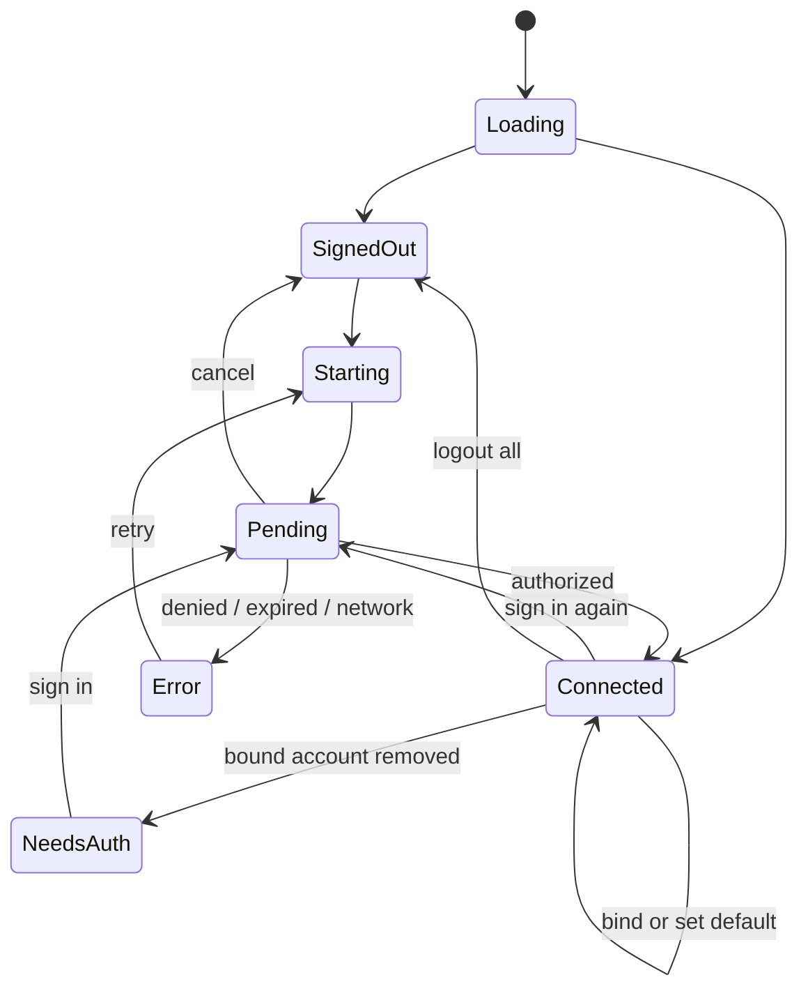

# Unified provider authentication UI design

Status: implemented
Date: 2026-08-09

## Design read

This is an incremental JCode Settings enhancement for developers. It should
feel restrained, trustworthy and tool-like. It reuses the existing Provider
cards, form hierarchy, tokens, controls and Heroicons; it does not introduce an
Auth Center, another Settings tab, a new modal language or a component library.

Design dials: variance 4, motion 2, density 6.

## Information architecture

```text
Settings
└─ Providers
   ├─ Model roles
   ├─ Provider cards
   │  └─ Authentication summary and recovery action
   └─ Add / Edit provider
      ├─ Provider
      ├─ Authentication
      │  ├─ API key
      │  └─ Account login
      │     ├─ Device code panel
      │     ├─ Account binding
      │     └─ Account management disclosure
      ├─ Model connection
      └─ Advanced
```

Authentication choices are declared by the backend:

- OpenAI: **API key** or **Sign in with ChatGPT**;
- xAI / Grok: **API key** or **Sign in with Grok**;
- GitHub Copilot: **Sign in with GitHub**;
- custom OpenAI-compatible Provider: **API key** only.

The UI must not infer these choices from Provider IDs.

## Form design

When there are two choices, the Authentication section uses the existing
segmented control. A single choice renders as a compact section label and its
control without a redundant selector.

API-key mode preserves the current password field and advanced endpoint/header
controls. Account mode removes API-key, editable endpoint/header, and custom
image-endpoint controls from the task, because the backend pins the chat route
and image endpoints currently require a separate Provider API key.

Signed-out account mode shows one primary login action and short explanatory
copy. Starting a login replaces that row inline with:

- provider name and “Waiting for authorization” status;
- a large monospace user code with Copy action;
- Open browser and Cancel actions;
- a subdued expiry time;
- an `aria-live` pending/error message.

No dialog is stacked on the Provider form.

## Connected accounts

After login, the primary row contains a `UserCircleIcon`, account login and
method label. The binding select offers:

- “Use default account — alice@example.com”;
- each usable explicit account;
- expired accounts disabled and labelled “Sign in again.”

“Manage N accounts” expands in place. Rows expose Default, Bound and Needs
sign-in chips as applicable, followed by Set default, Sign in again or Remove.
Provider removal and account removal are separate actions. Remote avatars are
not loaded.

## Provider-card summaries

- API key: “API key configured” — never “Connected” without a validation
  result;
- managed and healthy: “Connected · alice@example.com · ChatGPT OAuth”;
- follows default: include “Default account” in the accessible label;
- missing account: warning token plus “Choose account”;
- invalid refresh: destructive token plus “Sign in again.”

Changing or removing a global account immediately refreshes all affected card
summaries.

## State machine



The polling timer is cleared on cancel, form close, tab change and unmount.
Successful authorization refreshes auth status, Provider list, target catalog
and the model picker.

## Responsive and accessibility behavior

- Authentication options wrap to a two-column grid and one column at narrow
  widths.
- Text labels remain visible; meaning never depends on color or an icon.
- Buttons retain visible focus rings and at least the existing JCode target
  height.
- Copy and browser-open actions have accessible names.
- Pending uses `role=status`; failures use `role=alert`.
- Motion is limited to the existing spinner and disclosure transition, and
  respects reduced-motion behavior inherited from the app.

## Visual tokens

Reuse `INPUT`, `BTN_PRIMARY`, `BTN_SECONDARY`, `BTN_DANGER`, `ROW`, `LABEL`,
`CHIP` and `Segmented` from the Settings atoms. Use only existing CSS custom
properties and Heroicons (`KeyIcon`, `UserCircleIcon`, `ArrowPathIcon`,
`ClipboardDocumentIcon`, `ArrowTopRightOnSquareIcon`,
`ExclamationTriangleIcon`). Provider branding continues through
`ProviderIcon`; no hand-written SVG or hard-coded status color is added.
