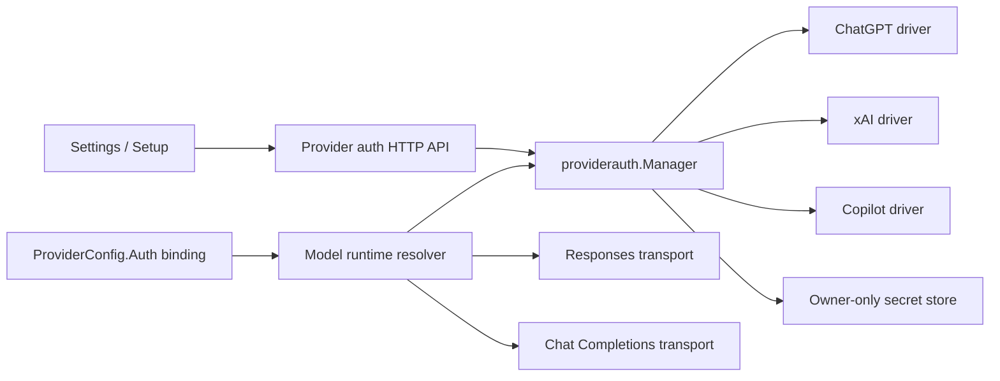

# Unified provider authentication architecture

Status: implemented
Date: 2026-08-09

## Decision

JCode will use one managed-account service for lifecycle and storage, with one
driver per authentication method. Provider configuration contains a
non-secret binding. Model transports obtain a credential at request dispatch,
not when a model is cached.



## Configuration contract

```json
{
  "providers": {
    "openai": {
      "auth": {
        "method": "codex_oauth",
        "account_id": "optional-stable-account-id"
      }
    }
  }
}
```

`account_id` omitted means “follow the default usable account for this login
method.” This is convenient but intentionally visible in the UI. Selecting an
explicit account avoids a Provider changing identity when the default changes.

The binding never contains tokens. Existing Providers without `auth` continue
to use `api_key` and preserve their current behavior.

The current custom image endpoint reuses its Provider API key. A Provider using
managed account authentication therefore cannot also own an `image_endpoint`;
switching it to managed authentication clears that endpoint and any selected
image-model role. Configure image generation under a separate API-key Provider.

## Package boundaries

### `internal/providerauth`

- public method/account/device-flow/status types;
- a process-wide manager with an injectable HTTP client and store for tests;
- device-flow state held only in memory and addressed by a random flow ID;
- durable account mutation and per-account refresh serialization;
- driver-specific endpoint, token and protected-header policy;
- no dependency on Web, TUI, ACP or model packages.

### `internal/model`

- resolves `ProviderConfig.Auth` through `providerauth`;
- keeps the existing Chat Completions implementation for API keys and
  Copilot;
- provides a Responses implementation for ChatGPT/Codex and xAI;
- caches clients/adapters, never bearer tokens;
- requests a credential for every dispatch so long-running sessions survive
  token expiry.

### `internal/web`

- exposes only public flow/account/status objects;
- validates that a selected login method is compatible with the Provider;
- allows an OAuth Provider to be created without `api_key` only after a usable
  account binding exists;
- never accepts an access or refresh token from the browser.

Web and Desktop share this API and React Settings implementation. TUI and ACP
automatically benefit because all transports construct models through the same
model resolver.

## Driver policy

| Method | Durable secret | Access token | Base URL | Wire protocol | Protected headers |
| --- | --- | --- | --- | --- | --- |
| `codex_oauth` | refresh token | memory, refresh before expiry | `https://chatgpt.com/backend-api/codex` | Responses | `Authorization`, `chatgpt-account-id`, `originator`, `version` |
| `xai_oauth` | refresh token | memory, refresh before expiry | `https://api.x.ai/v1` | Responses | `Authorization` |
| `github_copilot` | GitHub OAuth token | Copilot token in memory | account-resolved Copilot API origin | Chat Completions | `Authorization` and Copilot client fingerprint headers |

ChatGPT/Codex requests force `store:false`, encrypted reasoning continuation,
the required tool fields and streaming behavior. xAI requests omit
ChatGPT-private fields. Copilot starts with the broadly supported Chat
Completions path; a future model-catalog capability may opt individual models
into Copilot Responses without changing the account contract.

Copilot request metadata is classified at the model boundary. A top-level user
request uses `x-initiator:user`; tool continuations and delegated agents use
`x-initiator:agent`, and delegated agents also use
`x-interaction-type:conversation-subagent`. A one-way hash of the JCode session
ID produces a stable `x-interaction-id` for the whole interaction, while each
dispatch receives fresh request/task UUIDs. The raw session ID is never sent.

## Storage and concurrency

- Directory mode: `0700`; secret file and lock: `0600`.
- Write: reload under an OS advisory lock, mutate, write a same-directory temp
  file, chmod, fsync, rename, fsync directory.
- Access tokens and pending device codes are never serialized.
- A process-local mutex complements the OS lock.
- Refresh uses a per-method/account lock and double-checks the memory cache.
- Rotated refresh tokens replace the old token only if the durable value still
  matches the token used for refresh. Otherwise the newer durable value wins.
- Removing an account invalidates matching in-memory credentials immediately.
- Login commits compare a durable per-method generation captured at Start;
  Logout advances it atomically so an in-flight flow in this or another process
  cannot restore the deleted account.
- Pending-flow capacity is reserved before contacting an authorization server,
  and a flow ID is always checked together with its authentication method.

## Security invariants

1. Managed upstream scheme and host are fixed by the driver. They are not read
   from Provider `base_url` or custom headers.
2. OAuth and managed model requests do not follow redirects; authorization
   responses are size-bound.
3. Verification links and xAI discovery must use the expected HTTPS host;
   xAI discovery must also return the expected issuer and authorization host.
4. GitHub.com Copilot is supported initially. Enterprise domains require a
   separate host-validation policy before enablement.
5. Protected headers are applied after user headers; managed Providers do not
   accept replacements for them.
6. Errors expose bounded OAuth codes/descriptions, not raw bodies or tokens.
7. A missing, removed or expired binding fails closed before an upstream model
   request.
8. Provider Cloud sync may carry the non-secret binding, but the secret store
   is local-only.

## Failure behavior

- `authorization_pending` and `slow_down` remain pending; slow-down increases
  the server-side poll deadline.
- deny, expiry and cancel destroy the in-memory flow.
- invalid refresh persists `requires_reauth` and clears the access-token cache.
- transient network failure preserves the account and returns a retryable
  error.
- deleting an account does not delete a Provider. A Provider bound to that
  account becomes `needs_auth` and cannot run until rebound.

## Rollout

1. Land the generic manager/store and fake-server POC tests.
2. Land runtime credential injection and Responses transport tests.
3. Add Provider and setup HTTP contracts.
4. Add the shared Web/Desktop UI and five locales.
5. Run focused, full lint/build/test, then independent security, architecture
   and UI reviews.
